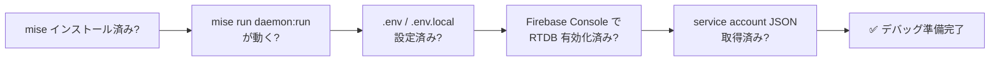
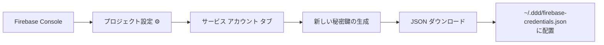
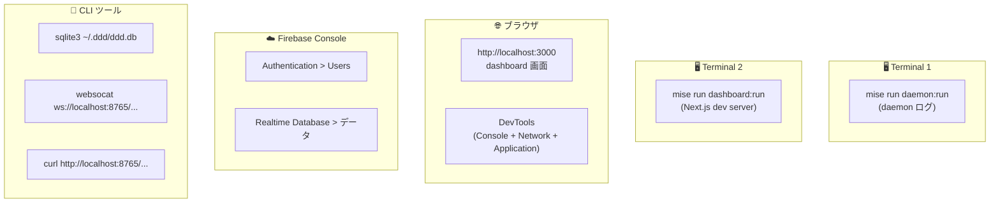
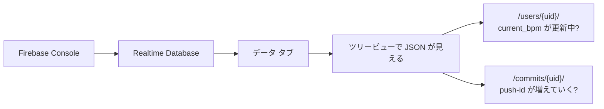
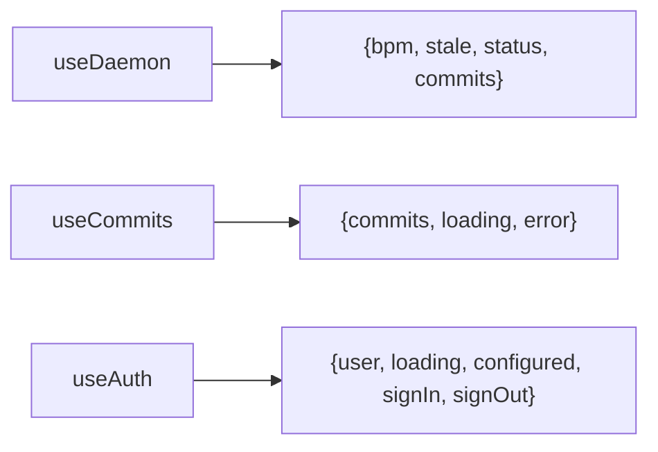
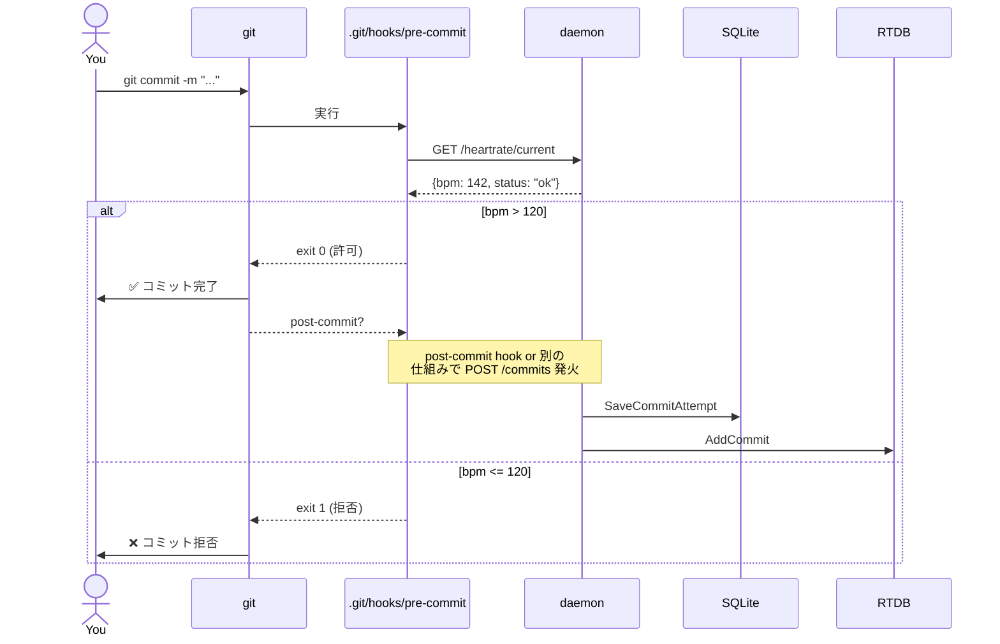
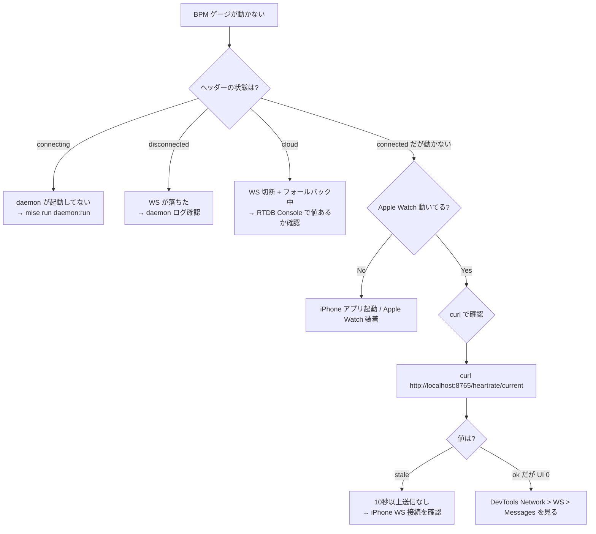
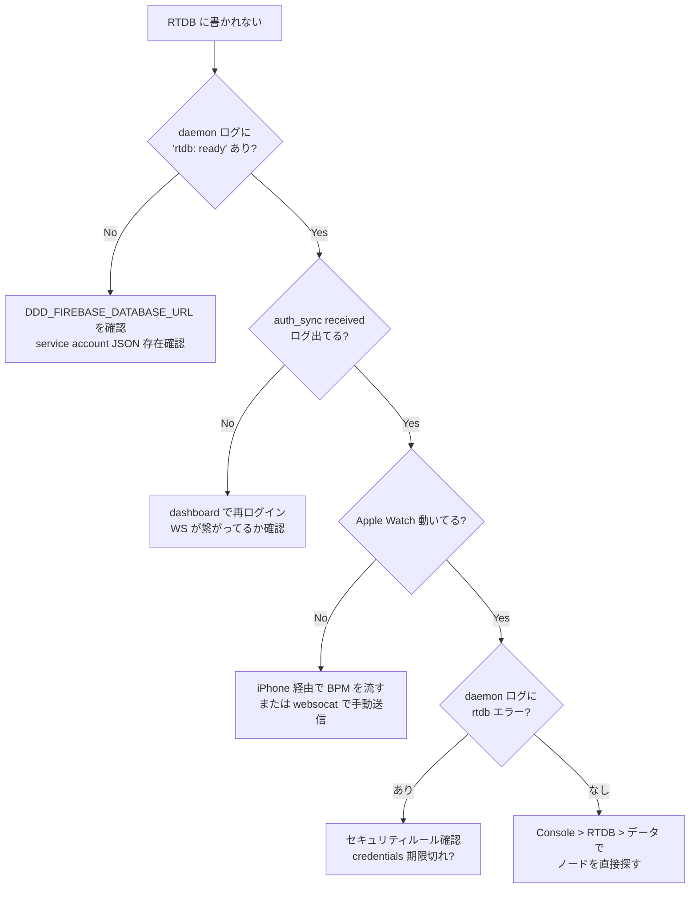
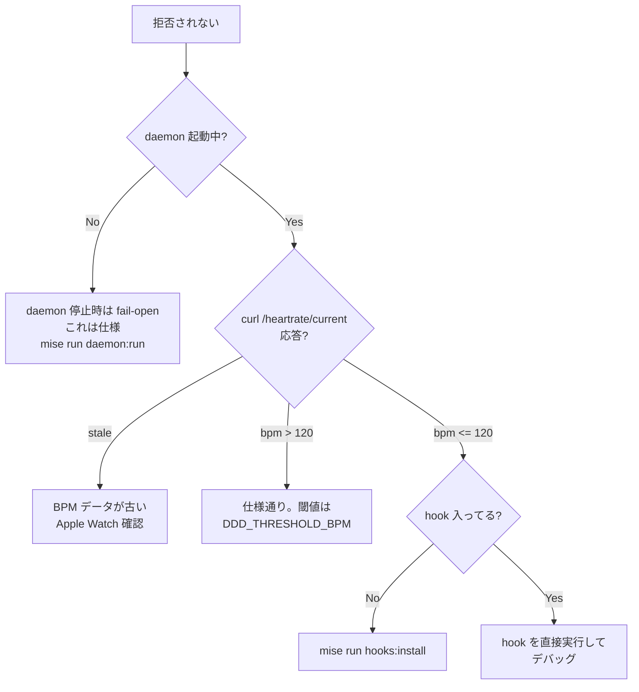
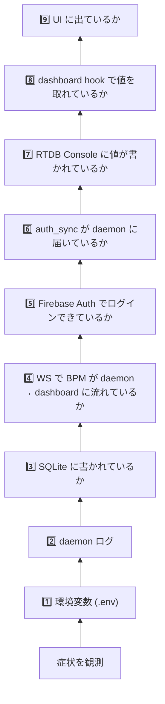

# DDD デバッグガイド — DB・認証・データフロー全部のせ

**対象**: daemon (Go) / dashboard (Next.js) / Firebase (Auth + RTDB) / SQLite / WebSocket / git hook

開発中に「BPM が表示されない」「ログインできない」「RTDB に値が書かれない」等が起きた時、**どこを開いて何を見るか**を順序立ててまとめた実用ガイド。

---

## 0. 事前準備チェックリスト



### 0-1. 環境変数の最低限セット

**プロジェクトルート `.env`**（daemon 用、`mise` が読む）:
```bash
DDD_DAEMON_PORT=8765
DDD_THRESHOLD_BPM=120
DDD_FIREBASE_CREDENTIALS=~/.ddd/firebase-credentials.json
DDD_FIREBASE_DATABASE_URL=https://<your-project>-default-rtdb.firebaseio.com/
# DDD_FIREBASE_PROJECT_ID は credentials JSON から自動取得されるので空でも可
```

**`dashboard/.env.local`**（Next.js が読む。`.env.example` をコピー）:
```bash
NEXT_PUBLIC_FIREBASE_API_KEY=...
NEXT_PUBLIC_FIREBASE_AUTH_DOMAIN=...
NEXT_PUBLIC_FIREBASE_PROJECT_ID=...
NEXT_PUBLIC_FIREBASE_APP_ID=...
NEXT_PUBLIC_FIREBASE_DATABASE_URL=https://<your-project>-default-rtdb.firebaseio.com/
NEXT_PUBLIC_DAEMON_URL=http://localhost:8765
NEXT_PUBLIC_DAEMON_WS_URL=ws://localhost:8765/ws/vscode
```

> ⚠️ **`.env` と `dashboard/.env.local` は別物**。daemon と dashboard で別のファイルを読みます。

### 0-2. service account JSON の取得



```bash
mkdir -p ~/.ddd
mv ~/Downloads/<project>-firebase-adminsdk-*.json ~/.ddd/firebase-credentials.json
chmod 600 ~/.ddd/firebase-credentials.json
```

---

## 1. デバッグの起点 — どの「画面」を開いておくか



**おすすめタイル配置**: 左に Terminal 2 つ、右上にブラウザ＋DevTools、右下に Firebase Console。

---

## 2. レイヤー別デバッグ法

### 2-1. 🛡️ daemon — ログを読む

#### 起動時に出るべきログ

```
[起動成功時の典型出力]
DDD daemon starting on :8765
rtdb: ready                              ← 成功
auth_sync received: uid=ab*** name="o*"  ← dashboard がログインした時
```

#### 失敗パターン

| ログ | 意味 | 対応 |
|---|---|---|
| `firestore disabled: ...` | Firestore credentials の問題（無視可、休眠中） | 対応不要 |
| `rtdb: disabled (no credentials or database URL configured)` | `.env` の設定漏れ | `DDD_FIREBASE_DATABASE_URL` を確認 |
| `rtdb disabled: firebase credentials not found: ...` | JSON ファイルパスが間違い | `~/.ddd/firebase-credentials.json` の存在確認 |
| `rtdb: set current_bpm: ...` | 書き込み失敗（権限など） | RTDB のセキュリティルール確認 |
| `failed to start server: bind: address already in use` | ポート 8765 が使用中 | `lsof -i :8765` で PID 特定 → `kill` |

#### ログレベルを上げる

daemon は echo の `Logger()` ミドルウェアを使うので、HTTP リクエストが全部ログに出ます:
```
INFO    GET /commits?limit=100   200   1.2ms
```

#### 強制再起動

```bash
# ポート占有プロセスを見る
lsof -i :8765

# 強制 kill
kill -9 $(lsof -ti :8765)

# 再起動
mise run daemon:run
```

---

### 2-2. 📦 SQLite — ローカル DB を覗く

`daemon/internal/store/store.go` を見ると、SQLite は `~/.ddd/ddd.db` に作られます。

```bash
sqlite3 ~/.ddd/ddd.db
```

#### よく使うクエリ

```sql
-- スキーマ確認
.schema

-- 直近の心拍サンプル 10 件
SELECT id, bpm, recorded_at, source
FROM heart_rate_samples
ORDER BY recorded_at DESC
LIMIT 10;

-- 直近のコミット試行 10 件
SELECT id, repo_path, bpm_at_commit, result, attempted_at
FROM commit_attempts
ORDER BY attempted_at DESC
LIMIT 10;

-- 直近 1 時間の平均 BPM
SELECT AVG(bpm) AS avg_bpm, COUNT(*) AS samples
FROM heart_rate_samples
WHERE recorded_at >= datetime('now', '-1 hour');

-- 拒否率
SELECT
  COUNT(CASE WHEN result='accepted' THEN 1 END) AS accepted,
  COUNT(CASE WHEN result='rejected' THEN 1 END) AS rejected,
  ROUND(100.0 * COUNT(CASE WHEN result='accepted' THEN 1 END) / COUNT(*), 1) AS accept_pct
FROM commit_attempts;
```

#### ddd-stats CLI でレポート表示

```bash
mise run daemon:stats
```
→ SQLite を読んでターミナルにカラフルに統計表示する既存ツール。

---

### 2-3. 🔌 WebSocket — daemon との通信を直接覗く

WS は 2 系統:
- `/ws` — iPhone 専用（Apple Watch BPM を流し込む）
- `/ws/vscode` — dashboard / VS Code 拡張用（BPM 受信、auth_sync 送信）

#### websocat でマニュアル接続

```bash
# インストール
brew install websocat

# dashboard 経路に繋ぐ
websocat ws://localhost:8765/ws/vscode

# 接続後、bpm メッセージが 1 秒ごとに流れてくるはず:
# {"bpm":0,"status":"stale","type":"bpm"}
# {"bpm":142,"type":"bpm"} ← Apple Watch 動いてる時

# auth_sync を手動で送る（Firebase ログインを模倣）
# 接続中のターミナルで↓を貼る
{"type":"auth_sync","uid":"debug-uid-123","displayName":"Debug User"}

# daemon ログに `auth_sync received: uid=de*** name="D******"` が出ればOK
```

#### iPhone 側の WS を模倣して BPM を流す

```bash
websocat ws://localhost:8765/ws
# 接続後、これを貼る（タイムスタンプは現在時刻）
{"bpm":150,"timestamp":"2026-05-23T15:00:00Z"}
```

→ daemon の buffer に乗り、1Hz ticker で RTDB に書かれるはず。

---

### 2-4. 🌐 HTTP API — daemon の REST を直接叩く

```bash
# ヘルスチェック
curl -s http://localhost:8765/health
# {"status":"ok"}

# 現在 BPM（git hook が叩くやつ）
curl -s http://localhost:8765/heartrate/current
# {"bpm":142,"status":"ok"}  or  {"bpm":0,"status":"stale"}

# 直近 10 件のコミット履歴
curl -s "http://localhost:8765/commits?limit=10" | jq '.[0:3]'

# 直近 100 件の心拍履歴
curl -s "http://localhost:8765/heartrate/history?limit=100" | jq '.[0:3]'

# コミット結果を手動で送り込む（pre-commit hook の代わり）
curl -X POST http://localhost:8765/commits \
  -H "Content-Type: application/json" \
  -d '{"repo_path":"/tmp/test","commit_hash":"abc123","bpm":150,"result":"accepted"}'
```

---

### 2-5. 🔥 Firebase Realtime Database — Console で値を確認



#### ライブで更新を見る

Firebase Console の Realtime Database 「データ」タブを開いておくと、daemon が書き込むたびに値が **ブリンク** します。`current_bpm` が 1 秒ごとに数値が変化するのが見えれば OK。

#### よくある「書き込まれない」原因

| 症状 | 原因 | 確認方法 |
|---|---|---|
| 何も書き込まれない | daemon に uid が渡ってない | dashboard でログイン後、daemon ログに `auth_sync received` が出るか |
| 何も書き込まれない | rtdb が nil で起動 | daemon 起動ログに `rtdb: ready` か `rtdb: disabled` か |
| `current_bpm` だけ古い | Apple Watch が止まってる | `curl /heartrate/current` で `stale` になっていないか |
| `commits` だけ書かれない | pre-commit hook が叩いてない | `git commit` 時に hook 出力が出るか |

#### Console から手動でデータを書く

ノードの ⋮ メニュー → 「子を追加」/ 「編集」 で直接 JSON を流し込める。dashboard のフォールバック動作確認に便利。

例: dashboard の onValue 動作確認用に手動で BPM 値を変える
```json
/users/<your-uid>:
  current_bpm: 188
  updated_at: 1716480000000
```

---

### 2-6. 🔐 Firebase Auth — ログイン状態を確認

#### Firebase Console 側

```
Authentication > Users タブ
→ ログインしたユーザーが表示される
→ uid をコピーして RTDB / SQLite と突き合わせる
```

#### ブラウザ DevTools 側

dashboard 上で DevTools を開く（F12 / Cmd+Option+I）。

**Console タブで直接 auth 状態を見る:**
```js
// Firebase の内部状態にアクセス
firebase  // ← undefined のはず（モジュラー API のため）

// AuthProvider のコンテキストは React DevTools で見る必要があるが、
// 簡単な方法として、useAuth が露出してる localStorage / sessionStorage を確認:
Object.keys(localStorage).filter(k => k.startsWith("firebase:"))
// 例: ["firebase:authUser:..."]

JSON.parse(localStorage.getItem("firebase:authUser:..."))
// → {uid, email, displayName, ...} が見える
```

**Application タブ:**
```
Application > Local Storage > http://localhost:3000
→ firebase:authUser:... を選択
→ uid が JSON で見える
```

#### ログインできない時の切り分け

| 症状 | 確認 | 対応 |
|---|---|---|
| ログインボタンが押せない | Console で `useAuth().configured` の値 | `.env.local` の必須 5 変数 |
| ポップアップが即閉じる | Console エラー `auth/popup-closed-by-user` | ユーザー操作（無視 OK、コードで握り潰してる） |
| `auth/operation-not-allowed` | Firebase Console > Auth > Sign-in method | Google を有効化 |
| `auth/unauthorized-domain` | localhost が許可ドメインに無い | Firebase Console > Auth > Settings > Authorized domains に `localhost` 追加 |

---

### 2-7. ⚛️ Dashboard hooks — React 側の状態を見る



#### React DevTools

Chrome 拡張 [React Developer Tools](https://chromewebstore.google.com/detail/react-developer-tools/fmkadmapgofadopljbjfkapdkoienihi) をインストールすると Components タブが出る。

```
Components > Home (page.tsx を表す)
  ↓ Hooks セクションで:
    State: bpm = 142
    State: status = "connected"
    State: commits = [...]
```

#### Console から WebSocket 接続状態を強制的に見る

dashboard コードに一時的にデバッグ用 `console.log` を仕込む手もあるが、最速は Network タブ:

**Network タブ > WS フィルター:**
```
Name: vscode
Status: 101 Switching Protocols  ← OK
↓ クリックすると Messages タブが出る
  ↓ → daemon に送ったメッセージ（auth_sync など）
  ↑ ← daemon から来たメッセージ（bpm、commit_result）
```

→ **これが一番便利**。WS のリアルタイム通信が全部目視できる。

---

### 2-8. 🪝 git pre-commit hook — コミット時の挙動



#### hook がインストールされているか確認

```bash
ls -la .git/hooks/pre-commit
# 実行可能ファイルへの symlink か実体があれば OK

# 入ってなければ
mise run hooks:install
```

#### hook を手動で発火

```bash
# pre-commit を直接実行
.git/hooks/pre-commit
echo "exit: $?"
# 0 なら許可、1 なら拒否
```

#### hook のログを見る

`hooks/main.go` を見ると、daemon が応答しない場合は **exit 0**（fail-open）で続行します。なので「拒否されるはずなのにコミット通る」場合は daemon に届いてない可能性が高い:

```bash
# daemon が動いている前提
curl http://localhost:8765/heartrate/current
# 応答が無ければ daemon 停止中
```

---

## 3. シナリオ別デバッグレシピ

### 3-1. 「dashboard の BPM ゲージが動かない」



### 3-2. 「ログインしたのに RTDB に書き込まれない」



### 3-3. 「git commit が常に許可される（拒否されない）」



### 3-4. 「dashboard の Network タブで WS が 101 で接続するけど messages が空」

WS は接続できているがメッセージが流れない状況。原因の切り分け:

```bash
# daemon 内の 1Hz ticker は止まってない？
mise run daemon:run の出力に時々何か出てるか確認

# 直接 websocat で接続して受信できるか
websocat ws://localhost:8765/ws/vscode
# 毎秒 {"type":"bpm",...} が来るはず
```

もし `websocat` では来るのに dashboard では来ない場合 → ブラウザの拡張機能（広告ブロッカーなど）が WS をブロックしている可能性。

---

## 4. 「全部チェック」ワンライナー集

### 4-1. プロダクト全体の health check

```bash
# daemon
curl -sf http://localhost:8765/health && echo "✅ daemon" || echo "❌ daemon"

# RTDB（REST API 経由・credentials 不要のサイドチャネル確認）
curl -sf "$(grep DDD_FIREBASE_DATABASE_URL .env | cut -d= -f2 | tr -d ' ')users/.json" \
  && echo "✅ RTDB reachable" || echo "❌ RTDB unreachable"

# SQLite
sqlite3 ~/.ddd/ddd.db "SELECT COUNT(*) FROM heart_rate_samples" \
  && echo "✅ SQLite" || echo "❌ SQLite"

# dashboard
curl -sf http://localhost:3000 -o /dev/null && echo "✅ dashboard" || echo "❌ dashboard"
```

### 4-2. すべてのターミナルを 1 コマンドで起動（tmux ユーザー向け）

```bash
# .tmux.conf に追加 or 直接実行
tmux new-session -d -s ddd \
  "mise run daemon:run; bash" \; \
  split-window -h "cd dashboard && bun run dev; bash" \; \
  split-window -v "sqlite3 ~/.ddd/ddd.db; bash" \; \
  attach-session -t ddd
```

### 4-3. RTDB のスナップショットを定期取得（変化を見る）

```bash
# 5 秒ごとに RTDB の users ノードを表示
URL="$(grep DDD_FIREBASE_DATABASE_URL .env | cut -d= -f2 | tr -d ' ')users.json"
while true; do
  echo "--- $(date +%T) ---"
  curl -s "$URL" | jq .
  sleep 5
done
```

> ⚠️ ルールが `auth != null` の場合、未認証 curl では読めません。デバッグ中は一時的にルールを `".read": true` に緩めるか、認証付きで叩く。

---

## 5. Firebase セキュリティルール（デバッグ用）

開発初期はルールを緩めて、まず動かす:

```json
{
  "rules": {
    ".read": "auth != null",
    ".write": false
  }
}
```

→ **読み取りは認証済みなら誰でも OK、書き込みは Admin SDK（daemon）からのみ**。
（Admin SDK はルールバイパスするので daemon は影響なし）

完全に動作確認のためだけに一時的に緩める場合:
```json
{
  "rules": {
    ".read": true,
    ".write": true
  }
}
```
→ ⚠️ **本番では絶対にこれにしない**。誰でも書き換え可能になる。

---

## 6. よくあるハマりどころ集

| 症状 | 原因 | 解決 |
|---|---|---|
| `Mixed Content` エラー | https Vercel から ws://localhost に繋ごうとしてる | これは仕様。RTDB フォールバックで救済される設計 |
| daemon ログに `auth_sync` が出ない | dashboard 側の WS が `/ws/vscode` に繋がってない | DevTools Network > WS を確認 |
| `firebase: ready` と出るのに RTDB に書かれない | uid が空（auth_sync 来てない） | ログインし直す |
| dashboard の Network タブで CORS エラー | daemon の `ALLOWED_ORIGINS` 未設定 | 環境変数追加 or 既定値（`http://localhost:3000`）でOK |
| RTDB Console で値があるのに dashboard に出ない | **不整合 ①**: dashboard hooks が Firestore を見ている | `feature/dashboard-rtdb-sync` のマージ待ち |
| Apple Watch から送ったのに stale | iPhone アプリ側で WS が切れた | iPhone アプリ再起動 |
| git commit がいつも通る | daemon 停止中（fail-open 仕様） | daemon 起動 |
| `auth/popup-closed-by-user` がコンソールに出る | ユーザーがポップアップを閉じた | コードで握り潰し済み、無視可 |
| 「.env を編集したのに反映されない」 | Next.js は .env.local の変更で再起動が必要 | `mise run dashboard:run` を Ctrl+C → 再起動 |

---

## 7. デバッグ時に開いておくと便利なリンク

| URL | 用途 |
|---|---|
| `http://localhost:3000` | dashboard |
| `http://localhost:8765/health` | daemon health |
| `http://localhost:8765/commits?limit=20` | 直近コミット |
| `http://localhost:8765/heartrate/current` | 現在 BPM |
| Firebase Console > **Authentication** | ログインユーザー一覧 |
| Firebase Console > **Realtime Database** | データツリー（ライブ更新） |
| Firebase Console > **Project Settings > Service accounts** | 秘密鍵生成 |
| Firebase Console > **Realtime Database > Rules** | セキュリティルール |

---

## 8. デバッグの「型」: 切り分けの順番

迷ったら **下から上に**チェック:



各レイヤーは独立しているので「daemon 側で正常なら以降の問題は dashboard」というように切り離せる。

---

## 9. 「最終手段」リセット手順

すべてが壊れて何が原因か分からない時:

```bash
# 1. daemon を完全停止
kill -9 $(lsof -ti :8765) 2>/dev/null

# 2. SQLite を一旦退避（消すと履歴ロスト）
mv ~/.ddd/ddd.db ~/.ddd/ddd.db.bak

# 3. dashboard の Next.js キャッシュをクリア
rm -rf dashboard/.next

# 4. ブラウザ側の Firebase 認証 cookie / localStorage を全消し
#    DevTools > Application > Storage > Clear site data

# 5. RTDB を Console から「データ削除」（バックアップ取ってから）

# 6. 再起動
mise run daemon:run     # Terminal 1
mise run dashboard:run  # Terminal 2

# 7. dashboard でログインし直し、Apple Watch 起動
```

これでクリーンな状態から再現確認できる。

---

## 10. 参考

- [`docs/firebase-implementation-status.md`](./firebase-implementation-status.md) — 全体アーキテクチャの解説
- [`docs/rtdb-schema.md`](./rtdb-schema.md) — daemon が書く RTDB スキーマ
- [`docs/firebase-database-design.md`](./firebase-database-design.md) — dashboard 側の想定スキーマ
- [Firebase Admin SDK Go ドキュメント](https://firebase.google.com/docs/admin/setup#go)
- [Firebase Realtime Database REST API](https://firebase.google.com/docs/database/rest/start)
