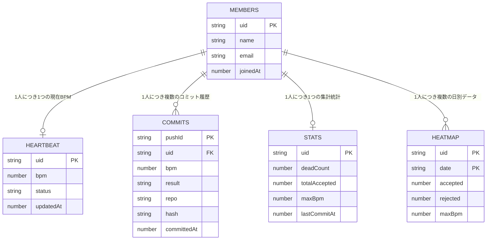

# Firebase Realtime Database 設計書

## 変更・追加ファイル一覧

| ファイル | 種別 | 内容 |
|---------|------|------|
| `dashboard/lib/firebase.ts` | 更新 | Realtime Database の接続を追加 |
| `dashboard/lib/firebaseTypes.ts` | 新規 | データ構造の型定義 |
| `.env.example` | 更新 | DATABASE_URL の項目を追加 |
| `docs/firebase-schema.json` | 新規 | サンプルデータ（動作確認・インポート用） |

---

## ファイル別コード説明

### 1. `dashboard/lib/firebase.ts`（更新）

Firebase との接続を管理するファイル。今回の変更点は2つ。

**追加した設定値（10行目）**
```ts
databaseURL: process.env.NEXT_PUBLIC_FIREBASE_DATABASE_URL,
```
Realtime Database に接続するための URL。`.env` に書いた値が自動で読み込まれる。

**追加したエクスポート（49行目）**
```ts
export const db: Database | null = app ? getDatabase(app) : null;
```
- `db` = Realtime Database への接続口
- `.env` が設定されていれば接続、未設定なら `null`（ローカルモードで動く）
- ダッシュボードのどこからでも `import { db } from "@/lib/firebase"` で使える

---

### 2. `dashboard/lib/firebaseTypes.ts`（新規）

Firebase に保存するデータの「型」を定義したファイル。
型を決めておくことで、コードを書くときに間違いを自動で検知できる。

```
Member       → チームメンバーの情報（名前・メール・参加日）
Heartbeat    → 現在のBPM（状態：ok / stale / offline）
CommitRecord → コミット1件の記録（BPM・結果・ハッシュ）
UserStats    → ランキング用の集計（DEAD回数・最高BPM など）
HeatmapDay   → 1日分のコミット数（ヒートマップ用）
```

**使い方イメージ**
```ts
import type { Heartbeat } from "@/lib/firebaseTypes";

// bpm が number であることを TypeScript が保証してくれる
const data: Heartbeat = { bpm: 145, status: "ok", updatedAt: Date.now() };
```

---

### 3. `.env.example`（更新）

```diff
  NEXT_PUBLIC_FIREBASE_API_KEY=
  NEXT_PUBLIC_FIREBASE_AUTH_DOMAIN=
  NEXT_PUBLIC_FIREBASE_PROJECT_ID=
  NEXT_PUBLIC_FIREBASE_APP_ID=
+ NEXT_PUBLIC_FIREBASE_DATABASE_URL=   ← 追加
```

チームメンバーが `.env` を作るときのテンプレート。
Firebase Console の Realtime Database 画面に表示される URL を記入する。

---

### 4. `docs/firebase-schema.json`（新規）

データがどう入るかを示すサンプルJSON。Firebase Console から
**「データ」→「⋮（メニュー）」→「JSONをインポート」** でそのまま読み込める。

---

## スキーマ設計（ER図）



---

## データの流れ

```
Apple Watch
  └─→ Go daemon（BPM受信）
        ├─→ Firebase: /heartbeat/{uid} を上書き    ← リアルタイムBPM表示・1v1対戦
        └─→ SQLite: ローカルにも保存（既存）

git commit 実行
  └─→ pre-commit フック
        └─→ Go daemon（コミット結果を記録）
              ├─→ Firebase: /commits/{uid}/{id} に追記   ← コミット履歴・情熱的なコミット
              ├─→ Firebase: /stats/{uid} を更新           ← DEADランキング
              ├─→ Firebase: /heatmap/{uid}/{今日} を更新  ← ヒートマップ
              ├─→ Discord Webhook に POST                  ← コミット通知（BPM付き）
              └─→ GitHub Status API に POST               ← PRのチェック欄にBPM表示
```

---

## テーブル別・使用機能の対応

| テーブル | キー構造 | 使う機能 |
|---------|---------|---------|
| `members` | uid | チームメンバー認証、名前表示 |
| `heartbeat` | uid | メンバー別BPM表示、1v1リアルタイム対戦 |
| `commits` | uid + pushId | 最も情熱的なコミット表示 |
| `stats` | uid | DEADランキング |
| `heatmap` | uid + date | 情熱ヒートマップ |

---

## 環境変数一覧

| 変数名 | 値の場所 | 用途 |
|-------|---------|------|
| `NEXT_PUBLIC_FIREBASE_API_KEY` | Firebase Console > プロジェクトの設定 | 認証キー |
| `NEXT_PUBLIC_FIREBASE_AUTH_DOMAIN` | 同上 | 認証ドメイン |
| `NEXT_PUBLIC_FIREBASE_PROJECT_ID` | 同上 | プロジェクト識別子 |
| `NEXT_PUBLIC_FIREBASE_APP_ID` | 同上 | アプリ識別子 |
| `NEXT_PUBLIC_FIREBASE_DATABASE_URL` | Firebase Console > Realtime Database | DBの接続先URL |

---

## 次のステップ

- [ ] セキュリティルール設定（自分のUID以外への書き込みを禁止）
- [ ] `/members` にチームメンバーを手動登録（Firebase Console）
- [ ] `.env` に `NEXT_PUBLIC_FIREBASE_DATABASE_URL` の実際の値を記入
- [ ] Go daemon から Firebase への書き込み実装（oto担当）
