# DDD Firebase 実装状況 — 解説ドキュメント

**最終更新**: 2026-05-23
**目的**: 現状の Firebase / DB 実装を把握する。何がどう繋がっているか、どこに不整合があるかを視覚的に解説する。

---

## 0. TL;DR

- ストレージは **4 層**（SQLite / Firebase Auth / Firebase Realtime Database / Firestore）
- daemon は **SQLite + RTDB** に書き込む。Firestore は休眠中
- dashboard は **WebSocket → daemon** が主経路、切断時のフォールバックで **Firestore** を読もうとしている（実態は空）
- **3 つの大きな不整合**がある: daemon と dashboard の読み書き先がズレている、RTDB スキーマが 2 種類並立、Firestore コードが残骸として残っている

---

## 1. 全体アーキテクチャ

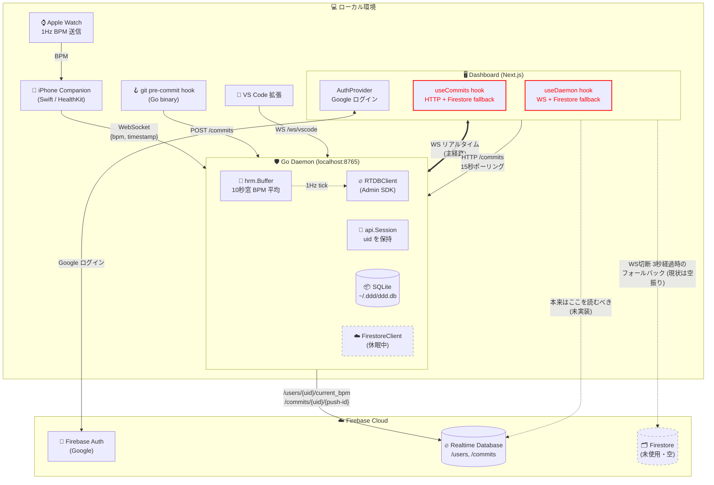

> 💡 **赤枠** = 不整合あり（後述）/ **点線** = 休眠・未実装

---

## 2. ストレージ層の役割

| # | ストレージ | 場所 | 書き込み | 読み取り | 用途 |
|:-:|---|---|---|---|---|
| ① | **SQLite** | ローカル `~/.ddd/ddd.db` | daemon | daemon の HTTP / git hook | 永続ローカル履歴・BPM 閾値判定 |
| ② | **Firebase Auth** | Google 側 | dashboard (ログイン操作) | dashboard | UID 発行・認証状態管理 |
| ③ | **Realtime Database (RTDB)** | Firebase | daemon (Admin SDK) | dashboard (フォールバック想定) | リアルタイム BPM とコミット結果のクラウド中継 |
| ④ | **Firestore** | Firebase | 誰も書いてない | dashboard hooks の fallback コード | **本来は不要**。コード残骸 |

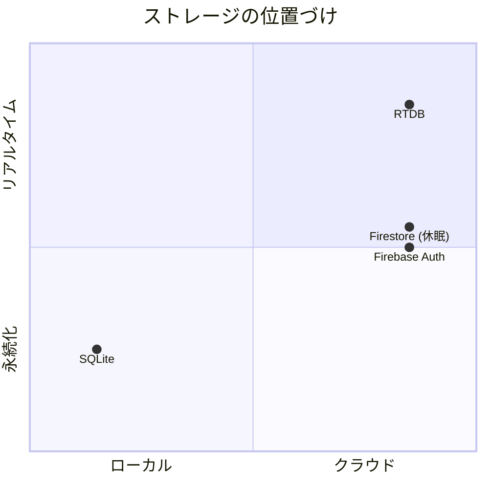

---

## 3. 書き込みフロー（daemon → クラウド）

### 3-1. BPM の流れ（Apple Watch → RTDB）

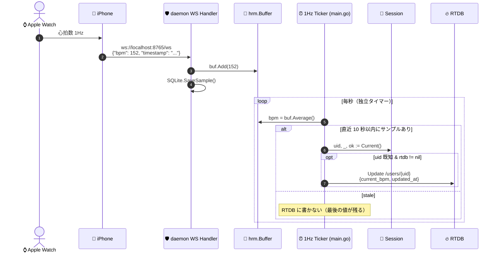

**ポイント**: BPM の RTDB 書き込みは **Apple Watch の送信レートに依存せず、daemon 内部の 1Hz ticker から発火**します。これにより「1 秒ごとに `/users/{uid}/current_bpm` を更新」という仕様を Apple Watch のスペックを問わず保証しています。

---

### 3-2. コミット結果の流れ（git hook → RTDB）

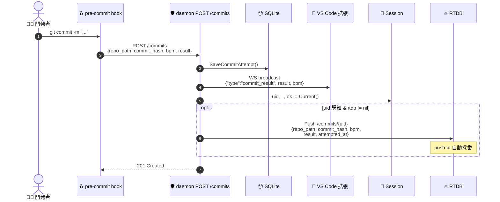

---

## 4. 認証フロー（dashboard → daemon に UID を渡す）

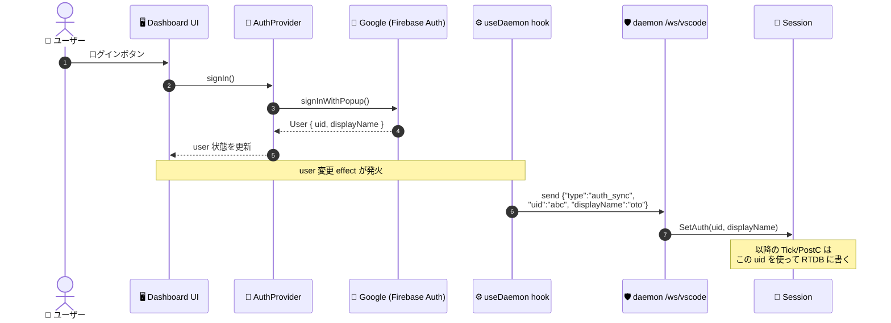

ログアウト時は空 uid を送って `Session.Clear()` が呼ばれます。
WS が再接続するたびに `open` ハンドラ内で `auth_sync` を再送する設計（user が変わってもズレない）。

---

## 5. 読み取りフロー（dashboard 側）

### 5-1. 状態機械（useDaemon の接続状態）

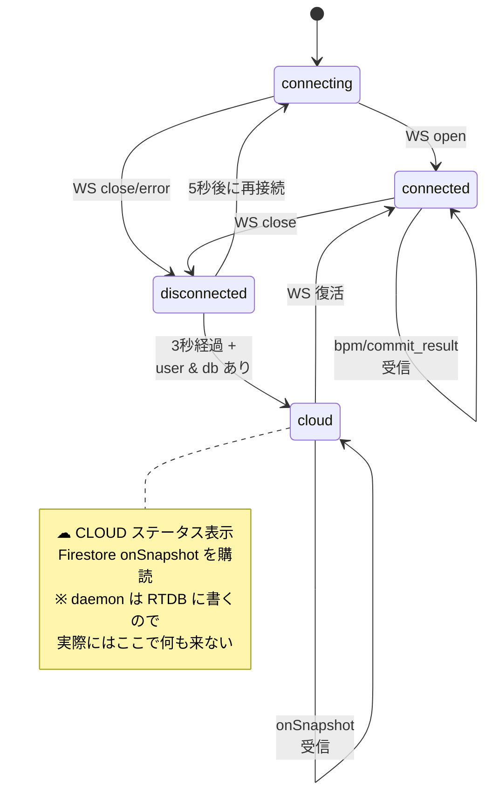

### 5-2. BPM 取得シーケンス

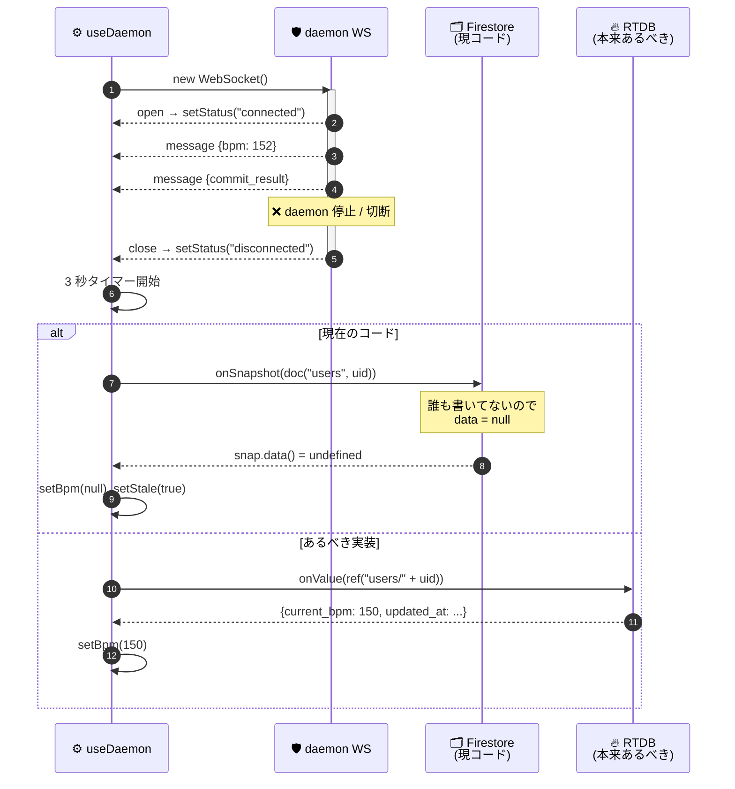

---

## 6. データスキーマの「2 つの世界」

ここが**一番混乱する部分**です。`docs/rtdb-schema.md`（daemon の私が書いた）と `docs/firebase-database-design.md` + `dashboard/lib/firebaseTypes.ts`（dashboard チームが書いた）で別物のスキーマが定義されています。

### 6-1. daemon が実際に書く形（`docs/rtdb-schema.md`）

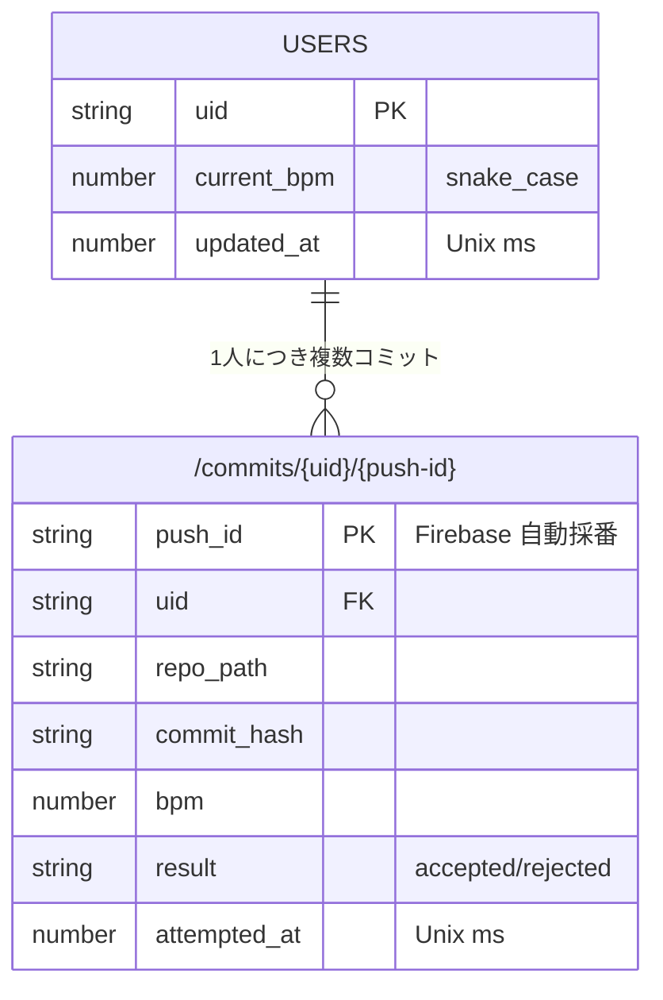

### 6-2. dashboard チームが期待する形（`firebaseTypes.ts`）

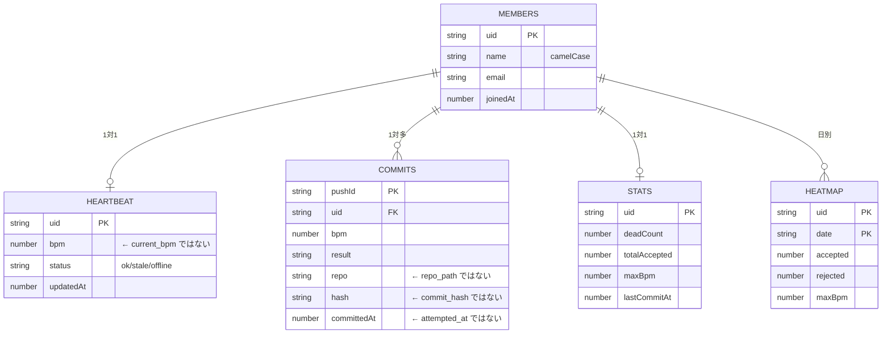

### 6-3. 差分まとめ

| 項目 | daemon が書く形 | dashboard が想定する形 |
|---|---|---|
| **BPM のパス** | `/users/{uid}` | `/heartbeat/{uid}` |
| **BPM のフィールド名** | `current_bpm`, `updated_at` | `bpm`, `status`, `updatedAt` |
| **コミットのフィールド** | `repo_path`, `commit_hash`, `attempted_at` | `repo`, `hash`, `committedAt` |
| **命名規則** | snake_case | camelCase |
| **メンバー一覧** | 想定なし | `/members/{uid}` |
| **集計** | 想定なし | `/stats/{uid}` (DEAD カウントなど) |
| **ヒートマップ** | 想定なし | `/heatmap/{uid}/{YYYY-MM-DD}` |
| **status フィールド** | 無い | `"ok" / "stale" / "offline"` |

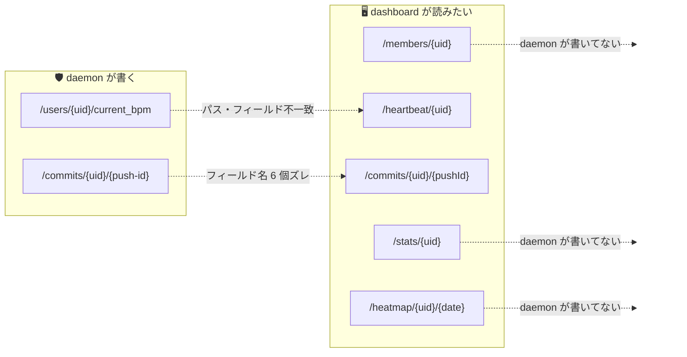

---

## 7. 3 つの不整合（再掲・要対応）

### 不整合 ①: daemon=RTDB / dashboard=Firestore

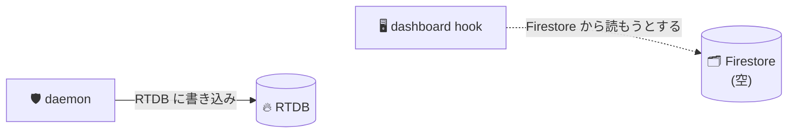
→ **WS 切断時に dashboard のフォールバックが空振りする**。`feature/dashboard-rtdb-sync` ブランチ（コミット `ad6101c`）が解決策。

### 不整合 ②: 2 つの RTDB スキーマが並立

`docs/rtdb-schema.md`（daemon） と `firebaseTypes.ts` + `docs/firebase-database-design.md`（dashboard）の間でパス・フィールド・命名規則すべて不一致。
→ どちらかに統一する設計判断が必要。

### 不整合 ③: Firestore コードが残っている

| 残置箇所 | 状態 |
|---|---|
| `daemon/internal/store/firebase.go` + テスト | dormant（呼ばれない） |
| `daemon/internal/api/handler.go` の `fs` フィールド | 受け取るが使わない |
| `daemon/cmd/ddd/main.go` の `OpenFirestore` 呼び出し | 起動時に走るが結果は使われない |
| `dashboard/lib/firebase.ts` の `db: Firestore` export | hooks が import している（ただし RTDB 切替後は不要） |
| `dashboard/app/hooks/useDaemon.ts` の `onSnapshot` | 動くが daemon の書き込み先と違う |
| `dashboard/app/hooks/useCommits.ts` の Firestore クエリ | 同上 |

---

## 8. ファイル別マップ

### daemon 側

```mermaid
flowchart TB
    main["cmd/ddd/main.go<br/>📍 エントリポイント"]
    main --> store_open["store.Open()<br/>SQLite を開く"]
    main --> fs_open["store.OpenFirestore()<br/>💤 結果未使用"]
    main --> rtdb_open["store.OpenRTDB()<br/>✅ ここから RTDB へ"]
    main --> handler_new["api.NewHandler(buf, db, fs, rtdb, session)"]
    main --> ticker["1Hz ticker goroutine<br/>→ h.WriteCurrentBpmToRTDB()"]

    handler["internal/api/handler.go"]
    handler --> ws_iphone["WS /ws<br/>iPhone から BPM"]
    handler --> ws_vscode["WS /ws/vscode<br/>auth_sync 受信 + bpm 配信"]
    handler --> post_commit["POST /commits<br/>SQLite + RTDB に書く"]

    session["internal/api/session.go<br/>🪪 uid 保持"]
    rtdb_file["internal/store/rtdb.go<br/>🔥 SetCurrentBpm / AddCommit"]
    firestore_file["internal/store/firebase.go<br/>💤 UpsertUserBpm / AddUserCommit<br/>(誰も呼ばない)"]
    store_file["internal/store/store.go<br/>📦 SQLite ラッパー"]

    handler --> session
    handler --> rtdb_file
    handler --> firestore_file
    handler --> store_file

    classDef dormant stroke:#888,stroke-dasharray: 5 5
    class fs_open,firestore_file dormant
```

### dashboard 側

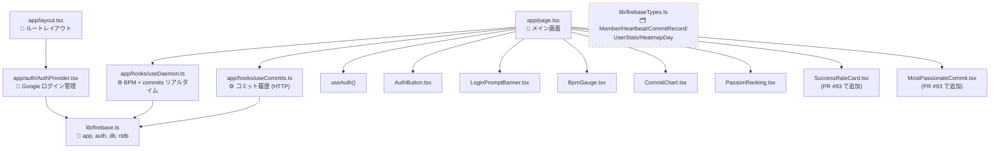

> ⚠️ `firebaseTypes.ts` は型定義だけ存在し、**まだどこのコードからも import されていない**。

---

## 9. 直近のマージ履歴

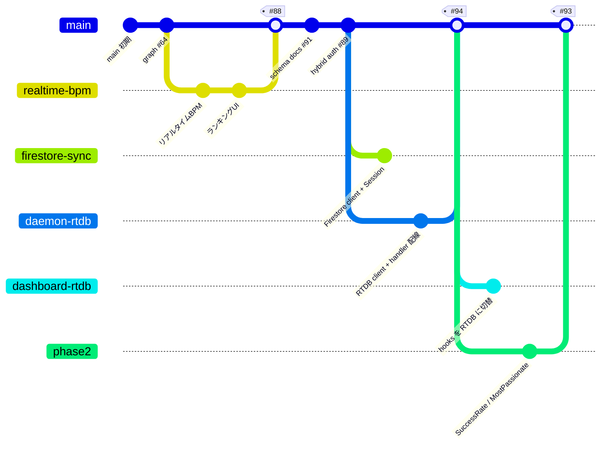

---

## 10. 推奨アクション（優先順）

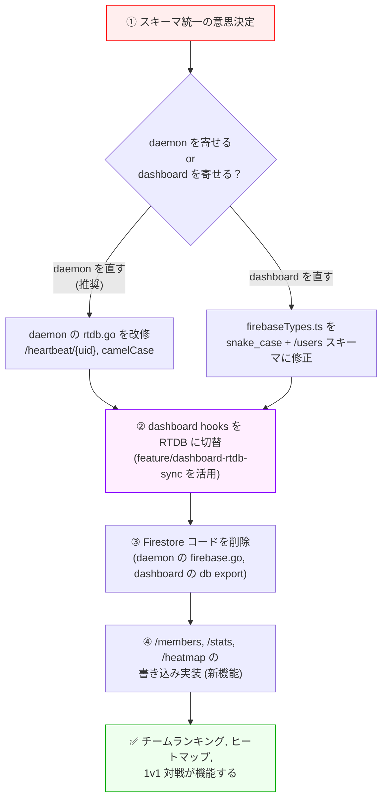

| 優先度 | 作業 | 担当目安 | 工数 |
|:-:|---|---|---|
| 🔴 必須 | ① スキーマ統一の方針決定 | 全員で MTG 30 分 | 0.5h |
| 🔴 必須 | ② dashboard hooks の RTDB 切替 | フロント | 1-2h（既にブランチあり） |
| 🟠 推奨 | ③ Firestore 残骸の削除 | バックエンド or フロント | 1h |
| 🟡 機能拡張 | ④ `/members`, `/stats`, `/heatmap` の daemon 書き込み | バックエンド | 3-4h |

---

## 11. 用語集

| 用語 | 意味 |
|---|---|
| **daemon** | ローカル常駐の Go プロセス。`mise run daemon:run` で起動 |
| **RTDB** | Firebase Realtime Database。JSON ツリー構造、書き込み回数課金なし |
| **Firestore** | Firebase の NoSQL DB。書き込み回数課金あり |
| **`auth_sync`** | dashboard → daemon WS メッセージ。ログイン UID を通知する |
| **Session** | daemon が `auth_sync` で受け取った uid をメモリ保持する仕組み |
| **fail-safe** | credentials 未設定でも crash せず機能を OFF にして起動継続する設計 |
| **fallback** | WS が届かない時に RTDB から読む経路（現在は Firestore を見てしまっている）|

---

## 12. 参考ファイル

| ファイル | 内容 |
|---|---|
| `docs/rtdb-schema.md` | daemon が実際に書く RTDB の形 |
| `docs/firebase-database-design.md` | dashboard 側の想定スキーマ（PR #91） |
| `docs/firebase-schema.json` | Firebase Console にインポートできるサンプル JSON |
| `docs/schema.md` | （古い）Firestore 前提のスキーマ案 |
| `docs/plans/firebase-sync-unified.md` | 統合計画書 |
| `docs/prs/feature-daemon-rtdb-sync.md` | daemon RTDB 側 PR の文案 |
| `docs/prs/feature-dashboard-rtdb-sync.md` | dashboard RTDB 切替 PR の文案 |
