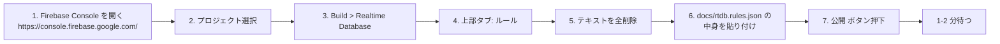

# Firebase RTDB セキュリティルール セットアップ

Vercel にデプロイした dashboard が Realtime Database を読み書きするには、
セキュリティルールを正しく設定する必要があります。本ドキュメントはその手順です。

---

## 1. 適用するルール

`docs/rtdb.rules.json` の内容と同じ:

```json
{
  "rules": {
    "users": {
      "$uid": {
        ".read": "auth != null",
        ".write": "auth != null && auth.uid === $uid"
      }
    },
    "commits": {
      "$uid": {
        ".read": "auth != null",
        ".write": "auth != null && auth.uid === $uid",
        ".indexOn": ["attempted_at"]
      }
    }
  }
}
```

### ルールの意味

| ノード | `.read` | `.write` | `.indexOn` |
|---|---|---|---|
| `users/{uid}` | 認証済みユーザーなら誰でも読める（他人の BPM 含む） | 本人のみ書き込み可 | 不要 |
| `commits/{uid}` | 同上 | 同上 | `attempted_at` で昇順インデックス |

- **daemon は Firebase Admin SDK + サービスアカウント**で書き込むので、ルールをバイパスする → 影響なし
- **dashboard は Firebase Web SDK + ユーザー認証**で読むので、`.read` ルールが効く

### `.indexOn` が必須な理由

dashboard の `useCommits` フックは:

```ts
query(ref(rtdb, `commits/${uid}`), orderByChild("attempted_at"), limitToLast(n))
```

を実行します。RTDB は `orderByChild` のキーに対応するインデックスが**事前に宣言されていない**と、
全件スキャンを避けるためエラーを返します:

```
Error: Index not defined, add ".indexOn": "attempted_at", for path "/commits/<uid>", to the rules
```

→ ルールの `commits/$uid/.indexOn` でこれを宣言します。

---

## 2. Firebase Console から手動で適用する手順



---

## 3. Firebase CLI から適用する場合（推奨・自動化向き）

```bash
# Firebase CLI インストール (mise で入れる場合)
mise use firebase=latest

# プロジェクトをログイン (一度だけ)
firebase login

# プロジェクトを初期化 (一度だけ)
firebase use --add  # プロジェクト ID を選択

# database.rules.json を docs/rtdb.rules.json から参照するか、
# firebase.json で rules ファイルパスを指定
cat > firebase.json <<EOF
{
  "database": {
    "rules": "docs/rtdb.rules.json"
  }
}
EOF

# デプロイ
firebase deploy --only database
```

---

## 4. ルール変更後のキャッシュ問題

dashboard のブラウザは古いルールを覚えている場合があるので、ルール更新後は:
1. ブラウザを **ハードリロード** (`Cmd+Shift+R`)
2. もしくは DevTools > Application > Clear Storage で全削除

---

## 5. トラブルシューティング

| エラー | 原因 | 対応 |
|---|---|---|
| `Permission denied` | `.read` が `false` のまま | 上のルールを公開 |
| `Index not defined, add ".indexOn"...` | `commits/$uid/.indexOn` 未設定 | 上のルールを公開 |
| ルールを公開してもエラーが消えない | ブラウザがキャッシュ中 | ハードリロード |
| Firebase Console でエラー表示 (Syntax) | JSON が壊れている | `docs/rtdb.rules.json` をそのままコピー |

---

## 6. 本番運用での更なる強化案

ハッカソン用の現ルールは「認証済みなら他人の commits も読める」設計です。本番投入時は:

```json
"commits": {
  "$uid": {
    ".read": "auth != null && (auth.uid === $uid || root.child('users').child($uid).child('public').val() === true)",
    ...
  }
}
```

のように **公開フラグ** や **チーム ID** で制限することを推奨します。
