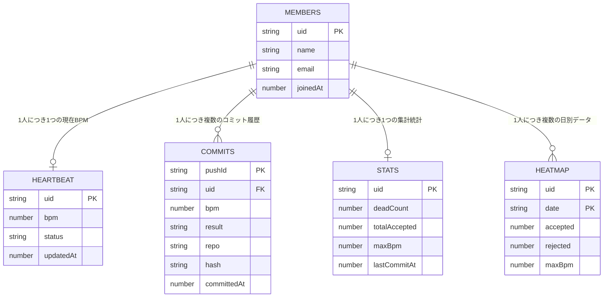

# Firebase Realtime Database スキーマ図

```mermaid
erDiagram
    MEMBERS {
        string uid PK
        string name
        string email
        number joinedAt
    }

    HEARTBEAT {
        string uid PK
        number bpm
        string status
        number updatedAt
    }

    COMMITS {
        string pushId PK
        string uid FK
        number bpm
        string result
        string repo
        string hash
        number committedAt
    }

    STATS {
        string uid PK
        number deadCount
        number totalAccepted
        number maxBpm
        number lastCommitAt
    }

    HEATMAP {
        string uid PK
        string date PK
        number accepted
        number rejected
        number maxBpm
    }

    MEMBERS ||--o| HEARTBEAT : "1人につき1つの現在BPM"
    MEMBERS ||--o{ COMMITS : "1人につき複数のコミット履歴"
    MEMBERS ||--o| STATS : "1人につき1つの集計統計"
    MEMBERS ||--o{ HEATMAP : "1人につき複数の日別データ"
```
