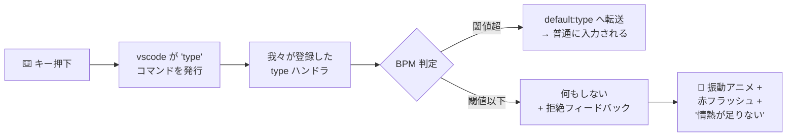
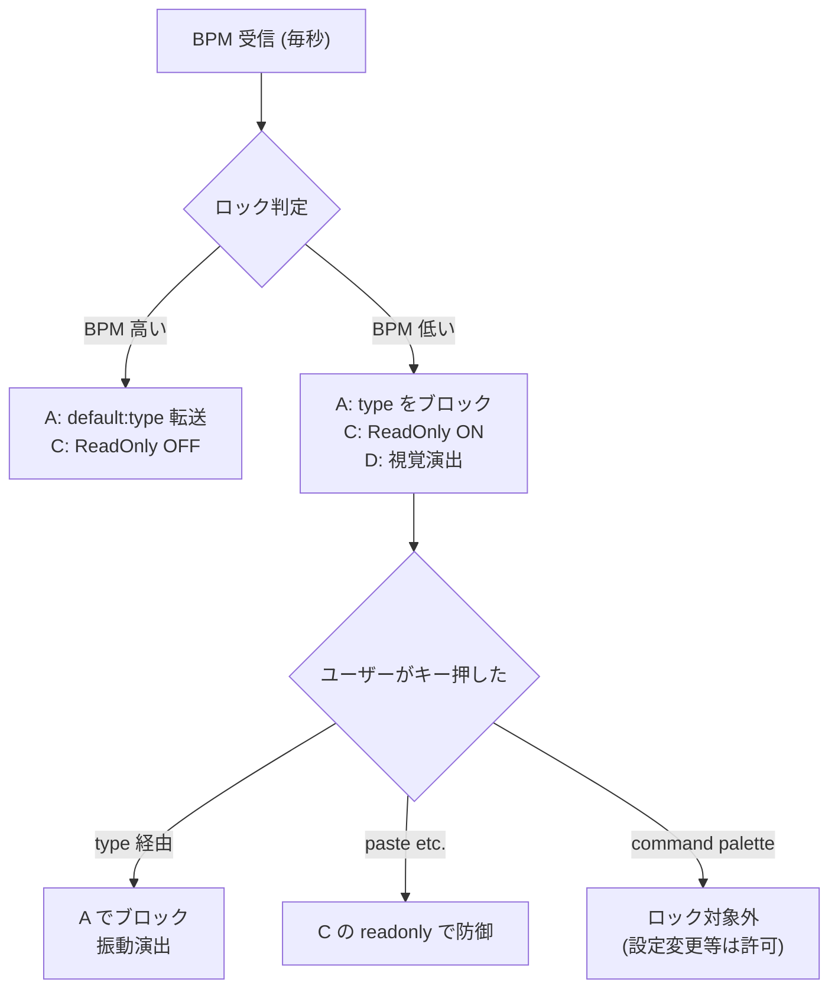
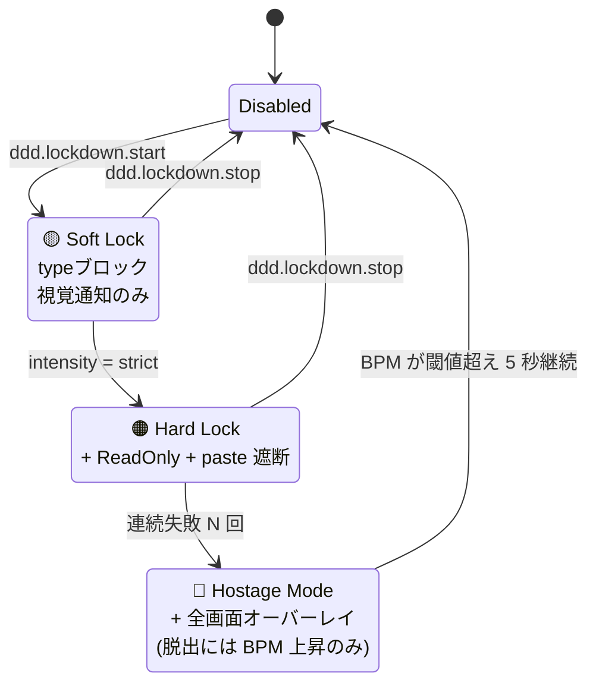
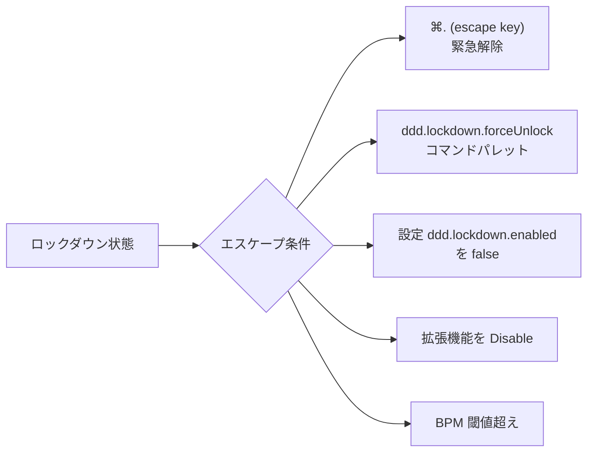
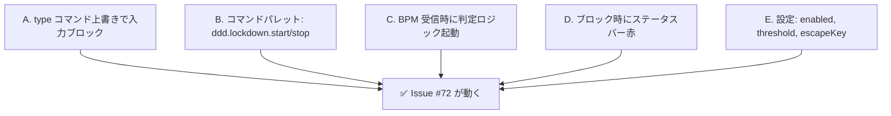
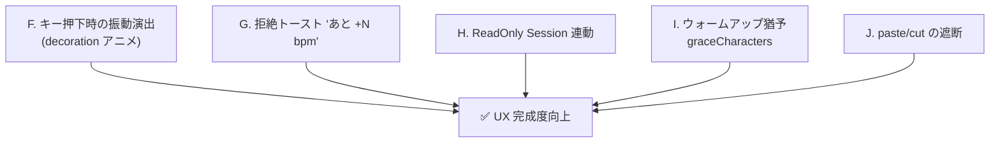
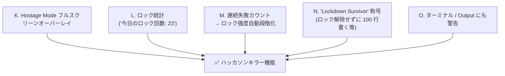
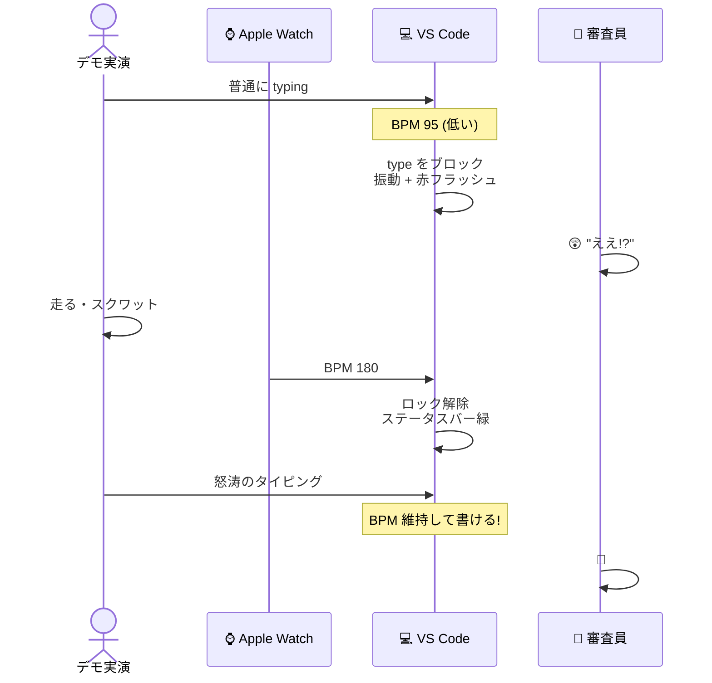

# VS Code 拡張 — Lockdown Mode 実装計画

**作成日**: 2026-05-23
**関連 Issue**: #72 [V-1] VS Code拡張: F-03 BPM閾値未満でエディタ入力を制限
**目的**: BPM が閾値以下のときコード入力を物理的にブロックする「ロックダウンモード」を実装する

---

## 0. TL;DR

**技術的には完全に可能**。VS Code には `commands.registerCommand("type", ...)` で**エディタへの全テキスト入力をフックする公式パターン**があり、VSCodeVim 等の Vim エミュレータもこの仕組みで動いている。



これは VS Code が **「`type` コマンドを誰かが登録していたらそちらを呼ぶ」契約**になっているため、合法的かつクリーンに介入できる。

---

## 1. 既存仕様との関係

| 既存 | 本機能との関係 |
|---|---|
| **#72 [V-1]** エディタ入力制限 | これそのもの。本計画書が #72 の実装案 |
| **既存の commit 演出（PR `feature/vscode-ext-presentation`）** | 補完関係。あちらは「コミット時点」の演出、こちらは「常時の入力ゲート」 |
| **ステータスバー BPM 表示** | 既に毎秒 BPM が拡張に届いている → そのまま流用 |
| **pre-commit hook** | コミット時の bpm 判定。本機能は **編集時の bpm 判定**。並立 |

→ **大幅な新規実装ではなく、既存 WS の BPM 受信に判定ロジックを足すだけ**で土台はある。

---

## 2. 技術的アプローチの比較

5 つの実装案を比較する。

### 2-1. Approach A: `type` コマンドの上書き（推奨）

```typescript
const disposable = vscode.commands.registerCommand("type", async (args) => {
  if (canType()) {
    return vscode.commands.executeCommand("default:type", args);
  }
  showLockdownFeedback(args);
});
```

| 評価項目 | 結果 |
|---|---|
| **クリーンさ** | ⭐⭐⭐⭐⭐ VS Code 公式の合法的な拡張ポイント |
| **完全性** | ⭐⭐⭐⭐ キーボード入力は 100% カバー |
| **副作用** | ⭐⭐⭐ paste / IntelliSense 確定は別経路（後述） |
| **他拡張との衝突** | ⚠️ Vim 系拡張と競合の可能性 |

**動作原理**:
- VS Code はキー入力時に内部で `type` コマンドを発行する
- 誰かが `type` を登録していれば、VS Code は **`default:type` ではなく登録された方を呼ぶ**
- 我々のハンドラから `default:type` に転送すれば普通の入力、転送しなければブロック

### 2-2. Approach B: 入力後の即時 Undo

```typescript
vscode.workspace.onDidChangeTextDocument((e) => {
  if (!canType() && isUserEdit(e)) {
    vscode.commands.executeCommand("undo");
  }
});
```

| 評価項目 | 結果 |
|---|---|
| クリーンさ | ⭐⭐ 入力した瞬間に undo するという乱暴な見た目 |
| 完全性 | ⭐⭐⭐⭐ paste 含むすべての変更を捕捉 |
| 副作用 | ⚠️ undo 履歴を汚す。フォーマット保存と競合 |

**用途**: 視覚演出として面白い（書いた瞬間に消える） → Phase 3 の派手モードで採用可能

### 2-3. Approach C: ReadOnly Session トグル

```typescript
vscode.commands.executeCommand("workbench.action.files.setActiveEditorReadonlyInSession");
```

| 評価項目 | 結果 |
|---|---|
| クリーンさ | ⭐⭐⭐⭐ VS Code 標準の UI（ロックアイコン付き） |
| 完全性 | ⭐⭐⭐⭐⭐ あらゆる編集をブロック |
| 副作用 | ⭐⭐ 切替が頻繁だとパフォーマンス影響、状態追跡が必要 |
| **粒度** | ⚠️ アクティブエディタのみ |

**用途**: A と併用。視覚的にロックされたことを伝える「defense in depth」

### 2-4. Approach D: モーダル WebView

```typescript
// BPM 低下時にフルスクリーン WebView を開いてフォーカスを奪う
```

| 評価項目 | 結果 |
|---|---|
| クリーンさ | ⭐⭐ ユーザー体験を強制的に中断する乱暴さ |
| 完全性 | ⭐⭐ パネル閉じれば回避できる |
| 演出インパクト | ⭐⭐⭐⭐⭐ |

**用途**: 重度ロックダウン（"hostage mode"）で採用可能

### 2-5. Approach E: キーバインド上書き

```jsonc
// package.json contributes.keybindings
{
  "key": "a", "command": "ddd.blockedType", "when": "ddd.locked"
}
```

| 評価項目 | 結果 |
|---|---|
| クリーンさ | ⭐ 全キーを列挙する必要 |
| 完全性 | ⭐⭐ 列挙漏れあり |

**不採用**。実装コスト高、メンテ困難。

### 2-6. 推奨: A + C のハイブリッド



**主防御 = A** で型しゃない入力（IME 変換確定含む）をブロック、**副防御 = C** で paste / drag-drop も塞ぐ。

---

## 3. ペースト・補完・保存の扱い

入力 = `type` だけではない。追加で考慮すべき経路:

| 経路 | コマンド名 | 対策 |
|---|---|---|
| **paste** | `editor.action.clipboardPasteAction` | 上書き or before-hook |
| **cut** | `editor.action.clipboardCutAction` | 上書き |
| **IntelliSense 確定** | `acceptSelectedSuggestion` | `type` を経由するので A で防げる場合あり、検証要 |
| **スニペット展開** | `editor.action.insertSnippet` | `applyEdit` 経由なので A では止まらない → ReadOnly で防御 |
| **drag-drop** | `editor.action.dragAndDropPaste` | ReadOnly で防御 |
| **Find&Replace** | `editor.action.replaceAll` | ReadOnly で防御 |
| **フォーマット保存** | `editor.action.formatDocument` | 自動発火。ロック中はスキップ推奨 |
| **AI 補完（Copilot 等）** | 各拡張固有 | A で大部分カバー、残りは ReadOnly |

→ **`type` 上書き + ReadOnly Session の二重防御で実用上問題なし**。

---

## 4. UX 設計

### 4-1. モード一覧



### 4-2. 視覚フィードバック（キー押下時）

| 強度 | フィードバック |
|---|---|
| **Mild** | ステータスバー赤フラッシュ 200ms |
| **Standard** | ステータスバー赤 + トースト「💢 情熱が足りない (現 ${bpm} bpm / 必要 ${threshold} bpm)」 |
| **Intense** | + カーソル行が左右に振動（decoration animation） + 拒絶音 |
| **Hostage** | + 画面全体が暗転し WebView オーバーレイ「Locked Out」 |

### 4-3. **絶対に必要な安全装置**



**理由**: BPM 取得デバイス（iPhone）が手元になくなった瞬間に **作業不能になる**のは致命的。必ず複数の脱出ルートを用意する。

### 4-4. 対象ファイルの制御

設定で対象範囲を選べるようにする:

```jsonc
"ddd.lockdown.filePatterns": {
  "type": "array",
  "default": ["**/*.go", "**/*.ts", "**/*.tsx", "**/*.py"],
  "description": "ロックダウン対象のファイルパターン（glob）"
}
```

→ ドキュメント（md / txt）は対象外にできるなど、現実的な運用に。

### 4-5. 「ウォームアップ猶予」

完全ロックは厳しすぎるので、**連続 N 文字までは許可**する設定も欲しい:

```jsonc
"ddd.lockdown.graceCharacters": {
  "type": "number",
  "default": 5,
  "description": "ロック中でも連続して N 文字までは入力を許可（タイポ訂正用）"
}
```

→ BPM が一瞬下がっても、5 文字分の余裕は与える。

---

## 5. 段階的実装ロードマップ

### Phase 1 — MVP（1〜2 時間）



### Phase 2 — 視覚演出強化（半日）



### Phase 3 — Hostage Mode + ゲーミフィケーション（1 日）



---

## 6. 主要なコード例

### 6-1. `type` コマンド上書きの実装

```typescript
let lockdownActive = false;
let currentBpm: number = 0;
let typeDisposable: vscode.Disposable | null = null;
let graceRemaining = 0;

function registerTypeOverride(context: vscode.ExtensionContext) {
  if (typeDisposable) return; // 二重登録防止

  typeDisposable = vscode.commands.registerCommand("type", async (args) => {
    if (canTypeNow()) {
      // 通常の入力として転送
      return vscode.commands.executeCommand("default:type", args);
    }
    // ロック中 → 視覚 + 音で拒絶
    triggerLockdownFeedback(args.text);
  });
  context.subscriptions.push(typeDisposable);
}

function canTypeNow(): boolean {
  if (!lockdownActive) return true;
  if (currentBpm >= THRESHOLD) return true;

  // 対象ファイル判定
  const editor = vscode.window.activeTextEditor;
  if (editor && !isLockdownTarget(editor.document)) return true;

  // ウォームアップ猶予
  if (graceRemaining > 0) {
    graceRemaining--;
    return true;
  }
  return false;
}
```

### 6-2. BPM 受信時のリセット

```typescript
function handleBpmUpdate(msg: { bpm: number; status?: string }) {
  // 既存のステータスバー更新...

  currentBpm = msg.bpm;

  // BPM が閾値を回復したら grace カウンタもリセット
  if (msg.bpm >= THRESHOLD) {
    graceRemaining = readConfig().lockdown.graceCharacters;
  }
}
```

### 6-3. 拒絶フィードバック

```typescript
function triggerLockdownFeedback(attemptedChar: string) {
  // ステータスバー赤点滅
  statusBar.backgroundColor = new vscode.ThemeColor("statusBarItem.errorBackground");
  statusBar.text = `$(lock) LOCKED — 必要 +${THRESHOLD - currentBpm} bpm`;

  // 200ms 後に元に戻す（後続の BPM 更新で上書きされる）
  setTimeout(() => {
    statusBar.backgroundColor = undefined;
  }, 200);

  // トースト（連射防止のため throttle）
  showLockdownToastThrottled();

  // 拒絶音（既存の playRejectedSound を流用）
  playLockdownChord();

  // カーソル行の振動アニメ（decoration）
  shakeCursorLine();
}

const showLockdownToastThrottled = throttle(() => {
  vscode.window.showWarningMessage(
    `💢 LOCKDOWN: 情熱が足りません (現在 ${currentBpm} bpm / 必要 ${THRESHOLD} bpm)`
  );
}, 3000);
```

### 6-4. ReadOnly Session 連動

```typescript
async function syncReadonlyState() {
  const shouldLock = lockdownActive && currentBpm < THRESHOLD;
  const isLocked = await getReadonlyState();
  if (shouldLock && !isLocked) {
    await vscode.commands.executeCommand(
      "workbench.action.files.setActiveEditorReadonlyInSession"
    );
  } else if (!shouldLock && isLocked) {
    await vscode.commands.executeCommand(
      "workbench.action.files.resetActiveEditorReadonlyInSession"
    );
  }
}
```

### 6-5. カーソル行の振動演出

```typescript
function shakeCursorLine() {
  const editor = vscode.window.activeTextEditor;
  if (!editor) return;

  const line = editor.selection.active.line;
  const decoTypes: vscode.TextEditorDecorationType[] = [];

  // 4 フレームの decoration を切替えて振動を演出
  const frames = [
    { backgroundColor: "rgba(255,0,0,0.3)", textDecoration: "; transform: translateX(-2px)" },
    { backgroundColor: "rgba(255,0,0,0.4)", textDecoration: "; transform: translateX(2px)" },
    { backgroundColor: "rgba(255,0,0,0.3)", textDecoration: "; transform: translateX(-1px)" },
    { backgroundColor: "rgba(255,0,0,0.2)", textDecoration: "; transform: translateX(0)" },
  ];

  frames.forEach((style, i) => {
    setTimeout(() => {
      const deco = vscode.window.createTextEditorDecorationType({
        ...style,
        isWholeLine: true,
      });
      decoTypes.push(deco);
      editor.setDecorations(deco, [new vscode.Range(line, 0, line, 0)]);
      setTimeout(() => deco.dispose(), 80);
    }, i * 40);
  });
}
```

> ⚠️ `transform: translateX` は VS Code の decoration では効かない可能性が高い（CSS transform の制限）。実際は `border-left` 幅を切替えて疑似的に揺らす方が確実。

### 6-6. コマンド登録（package.json）

```jsonc
"contributes": {
  "commands": [
    { "command": "ddd.lockdown.toggle", "title": "DDD: Lockdown Mode を切替" },
    { "command": "ddd.lockdown.start",  "title": "DDD: Lockdown Mode を開始" },
    { "command": "ddd.lockdown.stop",   "title": "DDD: Lockdown Mode を終了" },
    { "command": "ddd.lockdown.forceUnlock", "title": "DDD: 強制解除（緊急）" }
  ],
  "keybindings": [
    { "command": "ddd.lockdown.forceUnlock", "key": "ctrl+alt+escape", "mac": "cmd+alt+escape" }
  ]
}
```

### 6-7. 設定スキーマ

```jsonc
"ddd.lockdown.enabled": { "type": "boolean", "default": false },
"ddd.lockdown.threshold": {
  "type": "number",
  "default": 120,
  "description": "ロックを解除する BPM 閾値"
},
"ddd.lockdown.intensity": {
  "type": "string",
  "enum": ["soft", "standard", "intense", "hostage"],
  "default": "standard"
},
"ddd.lockdown.graceCharacters": { "type": "number", "default": 5 },
"ddd.lockdown.filePatterns": {
  "type": "array",
  "default": ["**/*.{ts,tsx,js,jsx,go,py,rs,java,c,cpp,h,swift}"]
},
"ddd.lockdown.blockPaste": { "type": "boolean", "default": true },
"ddd.lockdown.blockSave": { "type": "boolean", "default": false }
```

---

## 7. リスクと留意点

| リスク | 影響度 | 対策 |
|---|:-:|---|
| BPM 取得不能（iPhone なし）で全作業停止 | 🔴 致命 | デフォルト OFF。緊急解除ホットキー必須 |
| Vim 系拡張と `type` 競合 | 🟠 大 | 起動時に既存 type ハンドラを検出 → 警告表示。協調モード検討 |
| AI コード補完が動かない | 🟠 中 | 補完確定は別経路を試行。設定 `bypassAI: true` を用意 |
| ReadOnly 状態がスタックして元に戻らない | 🟠 中 | deactivate / panel dispose で必ずリセット |
| キー押下のたびに重い処理 | 🟡 小 | 判定は単純比較のみ、フィードバックは throttle |
| `transform` 系 CSS が decoration で効かない | 🟡 小 | border / background-color の切替で代替 |
| 「ロックされた！壊れた！」とユーザーが誤解 | 🟠 大 | 大きなステータスバー表示 + 起動時に必ずトースト案内 |
| Hostage Mode で本当に詰まる | 🔴 致命 | ⌘+Alt+Escape で必ず解除可能なホットキー |

---

## 8. テスト戦略

VS Code 拡張は一般的にユニットテストが薄い（モック困難）が、以下は確実に検証する:

| テスト項目 | 方法 |
|---|---|
| `canTypeNow()` ロジック | プレーン関数として切り出して unit test |
| BPM 受信 → 状態変化 | event emitter モックで検証 |
| ファイルパターンマッチ | minimatch との組合せ |
| 緊急解除キー | F5 起動 → 手動 |
| Vim 拡張併用 | F5 + Vim 拡張インストール → 手動 |
| ReadOnly toggle のスタック | activate/deactivate cycle テスト |

---

## 9. デモシナリオ

ハッカソン審査員に見せる流れ:



実演ポイント:
1. 普通に座って書こうとする → ブロックされる
2. その場で走る / 縄跳び
3. BPM が上がった瞬間にカチャカチャと書ける
4. 心拍が落ち着くと再びロック

---

## 10. 完了判定基準

| 機能 | 受け入れ条件 |
|---|---|
| 入力ブロック | BPM < threshold で typing が完全に止まる |
| 解除 | BPM >= threshold で 0.5 秒以内に書けるようになる |
| 緊急解除 | ⌘+Alt+Esc でロック完全 OFF |
| 視覚フィードバック | ブロック時にステータスバーが赤 + トースト |
| 対象ファイル制御 | .md など除外設定が効く |
| Vim 拡張併用 | 起動時に警告が出る or 協調動作 |

---

## 11. 参考

- VS Code API: [registerCommand](https://code.visualstudio.com/api/references/vscode-api#commands.registerCommand)
- VSCodeVim の `type` 上書き実装: https://github.com/VSCodeVim/Vim/blob/master/src/extensionBase.ts
- VS Code 内部の type コマンド契約: https://github.com/microsoft/vscode/blob/main/src/vs/editor/contrib/typeOperations
- 既存資産:
  - `vscode-ext/src/extension.ts` — WS 受信・ステータスバー・WebView パネル
  - `docs/plans/vscode-ext-presentation-upgrade.md` — コミット時演出
  - Issue #72 [V-1]

---

## 12. 推奨着手順

| 持ち時間 | 着手内容 |
|---|---|
| **30 分** | Phase 1-A だけ（type 上書き + 固定 OFF/ON コマンド） |
| **2 時間** | Phase 1 完走（コマンド + 設定 + 視覚フィードバック） |
| **半日** | Phase 1 + Phase 2 全部（振動 + grace + paste/cut + ReadOnly） |
| **1 日** | + Phase 3 Hostage Mode + 統計 |
| **2 日** | + Vim 拡張協調 + ユニットテスト + ドキュメント |

承認いただければ Phase 1 から着手します。
