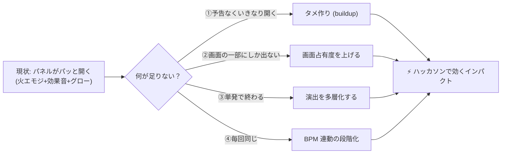
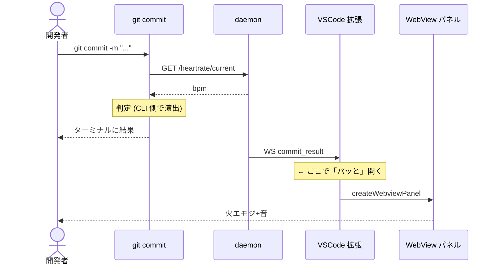
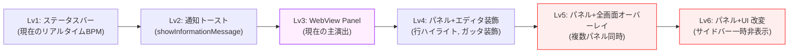
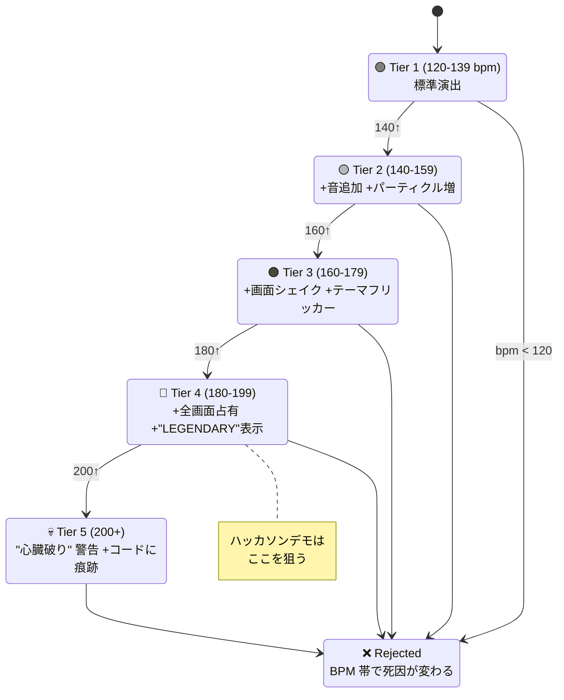
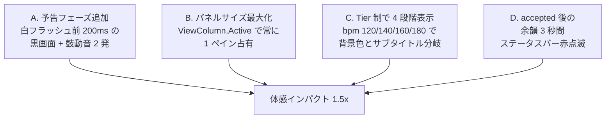
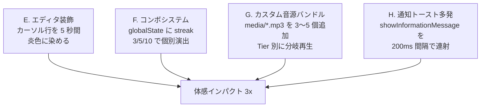
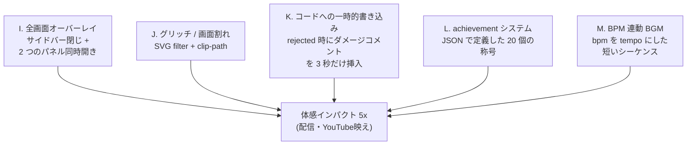

# VS Code 拡張 — コミット演出インパクト強化計画

**作成日**: 2026-05-23
**対象ファイル**: `vscode-ext/src/extension.ts`（現 500 行）
**目的**: 「パッと出てインパクトが足りない」を「思わず仰け反るレベル」に引き上げる

---

## 0. TL;DR



「足りない理由」は **`予告 → 主演出 → 余韻` の 3 段構えになっていない**ことと、**画面占有度が低い**こと、**強弱がない**ことの 3 つ。これらを潰す方向で計画する。

---

## 1. 現状分析

### 1-1. 既に実装されている演出

| カテゴリ | 内容 | コード位置 |
|---|---|---|
| **音** | macOS: `Hero.aiff` / `Basso.aiff` 、Windows: `tada.wav` / `chord.wav` | `playSystemSound()` |
| **ステータスバー** | BPM 数値リアルタイム表示。閾値超で赤背景 | `handleBpmUpdate()` |
| **成功パネル** | 赤グロー脈動背景 / 火エモジ 3連 / バウンス / heartbeat スケール / 25 個の火の粉パーティクル / 8 秒で自動クローズ | `getAcceptedHtml()` |
| **失敗パネル** | 赤グロー脈動背景 / 💔 シェイク / 統計ボックス（現在/閾値/不足）/ 上げ方サジェスト 5 項目 / 自動クローズなし | `getRejectedHtml()` |

### 1-2. 起動フロー（今の挙動）



→ **現状の問題点 = `Daemon → Ext → Panel` がノータイム**で起こる。タメがない。

### 1-3. インパクト不足の理由（自分なりの分析）

| # | 症状 | 構造的原因 |
|---|---|---|
| 1 | パッと出てパッと消える | 予告フェーズと余韻フェーズが無い（演出 = 主演出のみの 1 フェーズ構成） |
| 2 | エディタの隅で完結している | WebView パネルが ViewColumn.One に出るだけで、サイドバーや他エディタは普通に見えている |
| 3 | 何度見ても同じ | BPM 120 でも 200 でも同じ画面・同じ音 |
| 4 | 「物理的な変化」が無い | カーソル位置のコード自体は何も変化しない |
| 5 | 連続性がない | 直前のコミットと無関係。streak / コンボ表現がない |
| 6 | 効果音が短すぎる | システム音 1 発（500ms 程度）で終了 |

---

## 2. 設計戦略

### 2-1. 3 段構えに再設計

```mermaid
gantt
    title 新しい演出フェーズ（accepted/rejected 共通）
    dateFormat X
    axisFormat %s ms
    section accepted
    予告 (buildup)       :a1, 0, 800
    フラッシュ (peak)    :a2, after a1, 200
    主演出 (main)         :a3, after a2, 6000
    余韻 (afterglow)      :a4, after a3, 3000
    section rejected
    一瞬の停止 (freeze)   :r1, 0, 400
    崩壊 (collapse)       :r2, after r1, 1200
    主演出 (main)         :r3, after r2, 8000
    余韻 (cooldown)       :r4, after r3, 5000
```



**accepted の物語**:
1. **予告 (0-800ms)**: 心拍ドク...ドク...という低音だけ。画面はまだ通常。
2. **フラッシュ (800-1000ms)**: 全画面が一瞬白く飛ぶ。爆音。
3. **主演出 (1-7s)**: 既存の火炎パネル + さらに激しく
4. **余韻 (7-10s)**: パネル外のエディタにも残光が残る（ステータスバー、行ハイライト）

**rejected の物語**:
1. **フリーズ (0-400ms)**: 画面全体が一瞬グレースケールになる
2. **崩壊 (400-1600ms)**: グリッチ・RGB ズレ・破裂音
3. **主演出 (1.6-9.6s)**: 既存の💔パネル + より重い演出
4. **クールダウン (9.6-14.6s)**: エディタが暗く沈み、復帰する

### 2-2. 「画面占有度」の階層



**現状は Lv3**。Lv4〜Lv6 まで段階的に上げる。

### 2-3. BPM 段階別の演出強度



---

## 3. アイデアカタログ（実装オプション）

### 3-1. 🔊 サウンド演出

| アイデア | 実装難易度 | インパクト | 説明 |
|---|:-:|:-:|---|
| **多段サウンド** | ★ | ★★★ | `exec` を順次起動。`afplay sound1 && sleep 0.3 && afplay sound2` の連鎖 |
| **カスタム音源バンドル** | ★★ | ★★★ | 拡張内に `media/*.mp3` を同梱、`vscode.Uri.joinPath` で参照 |
| **WebView 内オーディオ** | ★ | ★★ | `<audio autoplay>` を WebView の HTML 内に入れる |
| **心拍ドンドンビルドアップ** | ★★ | ★★★★ | 鼓動音を 4 回打って徐々に間隔を縮め、最後に "ドガン" |
| **BPM 連動 BGM** | ★★★ | ★★★ | bpm の実値をテンポにした短い MIDI / アンビエント |
| **ボイス読み上げ** | ★★ | ★★★★ | macOS `say "PASSION COMMIT ACCEPTED"` で機械音声 |
| **Tier 別効果音** | ★★ | ★★★ | 180 超で「LEGENDARY」効果音、200 超で雷鳴 |

#### 推奨組み合わせ（accepted）
```
ドク↓ ドク↓ ドクドク（心拍ビルドアップ 800ms）
   ↓
ゴゴゴゴ ... ドガン！（フラッシュと同時に爆発音 200ms）
   ↓
Hero.aiff（既存・主演出開始）
   ↓
炎が燻る低音（余韻 BGM 3s ループ）
```

### 3-2. ✨ ビジュアル演出（WebView 内）

| アイデア | 効果 | 例 |
|---|---|---|
| **白フラッシュ** | フィルム的なインパクト | `body { background: white; opacity:1 → 0 }` を 200ms |
| **チャージ → 爆発** | 中央に光球が膨張 → 爆発 | radial-gradient + scale animation |
| **画面割れ** | ガラスが砕けるアニメ | CSS clip-path + 30 ピース個別 transform |
| **RGB スプリット** | 失敗時のグリッチ感 | `text-shadow: -2px 0 red, 2px 0 cyan` 振動 |
| **タイポグラフィ爆発** | 文字が物理的に飛び散る | 各文字を span 化、ランダム rotate+translate |
| **3D 回転** | パネル全体が立体的に回る | `transform: rotateY()` perspective |
| **ノイズ・ザラつき** | 失敗時の絶望感 | SVG filter `<feTurbulence>` |
| **タイマーカウントダウン** | 「3, 2, 1, GO!」表示 | setInterval + 巨大数字 |
| **ランクカード** | RPG 的な achievement | unlock animation + 称号文字列 |
| **コンボ数表示** | 連続成功カウンタ | 画面右上に "x3 COMBO" を常駐 |

### 3-3. 🛠️ VS Code 特化テクニック（パネル外への波及）

ここが「画面占有度」を上げる肝。WebView パネルの外にも演出を漏らす。

| 技 | 使う API | 効果 |
|---|---|---|
| **エディタ行を炎に染める** | `window.createTextEditorDecorationType({backgroundColor})` | 直前にカーソルがあった行の背景を 5 秒間炎色に |
| **ガッタに 🔥 を出す** | DecorationType の `gutterIconPath` | 行番号横に火エモジ |
| **インラインメッセージ** | DecorationType の `after.contentText` | "PASSION +50" などをコード末尾に浮かべる |
| **サイドバー一時非表示** | `executeCommand("workbench.action.closeSidebar")` | 集中演出のため UI を消す |
| **フォントズーム** | `executeCommand("editor.action.fontZoomIn")` | ドラマチックにズームインしてズームアウト |
| **ターミナル背景フラッシュ** | ターミナルに `\033[41m` などを送る | 連動演出 |
| **ピーク時 LED 風点滅** | StatusBarItem の text + backgroundColor を 100ms ごとに切替 | "♥ 188 ♥ ♥ 188 ♥" |
| **複数パネル同時開き** | `createWebviewPanel(..., ViewColumn.Beside)` を 2 枚 | 左に火炎、右にスコアカード |
| **通知トースト多発** | `showInformationMessage` を順次 | "🔥", "+50 BPM", "ACCEPTED" を時差で |
| **プログレスバー演出** | `withProgress({location: Notification})` | 0% → 100% を 800ms で滑らせる buildup |
| **エディタ振動** | カーソル位置を ±1 ぶれさせる | `selection = new Selection(...)` 連打 |
| **コードに痕跡** | rejected 時に末尾にコメント `// 💀 BPM 95` を一時挿入 → 3 秒後に削除 | エディタを直接いじる強烈な演出 |

### 3-4. 📈 状態・継続性

| 機能 | 概要 |
|---|---|
| **コンボカウンタ** | 連続 accepted 数を `globalState` に保存。3 連続で "TRIPLE"、5 連続で "INSANE" |
| **最高 BPM トラッキング** | パーソナルベスト更新時に追加演出 |
| **失敗ストリーク** | 連続 rejected で重みが増す（フォントが歪んでくる等） |
| **日次サマリー** | 起動時に「今日の情熱率」をトーストで表示 |
| **achievement 解除** | 「初の 180 超」「rejected 10 回」等で個別演出 |

---

## 4. 段階的ロードマップ

### Phase 1 — 1〜2 時間（クイックウィン、ハッカソン直前向け）



**到達点**: 既存パネルを土台にして「タメ → 出 → 余韻」を作る。ファイル追加なし、`extension.ts` のみ改修。

### Phase 2 — 半日（演出多層化）



**到達点**: パネル外にも演出が漏れる。「あの拡張すごい」と言われるレベル。

### Phase 3 — 1〜2 日（フル没入）



**到達点**: ハッカソンの「キラー機能」になるレベル。デモ映像が撮れる。

---

## 5. 技術的注意点

### 5-1. パネル外演出の API 制約

| API | できること | 制約 |
|---|---|---|
| `createWebviewPanel` | フル HTML/JS/CSS、`enableScripts: true` で `<audio>` 自動再生可 | 真の全画面は不可。エディタペイン内まで |
| `createTextEditorDecorationType` | 行/カラム/ガッタ装飾、`after.contentText` でインラインテキスト | カーソルが他ファイルに移ると失効 |
| `showInformationMessage` | 通知エリアに toast | 文字のみ、装飾不可 |
| `withProgress` | プログレスバーの toast | キャンセル可、装飾不可 |
| `executeCommand("editor.action.fontZoomIn")` | フォントサイズ変更 | ユーザー設定を上書き、戻し忘れ注意 |
| `workspace.applyEdit` | エディタにテキスト挿入 | 履歴に残るので undo で消える＝痕跡 |
| StatusBarItem.text の高頻度更新 | LED風点滅 | 100ms 間隔より速くしても視覚上限界あり |

### 5-2. パフォーマンス / 行儀

- WebView の `<audio>` は **ユーザー操作 1 回後**でないと自動再生ブロックされる場合あり。対応: パネル開いた瞬間に音再生を試み、失敗時は `exec()` システム音にフォールバック。
- パーティクル DOM を多用するとレンダラプロセス重くなる。**Canvas + requestAnimationFrame** に置き換えるとスムーズ。
- エディタ装飾は **明示的に dispose** しないと残る。`setTimeout` で必ず `decorationType.dispose()` する。
- フォントズーム/サイドバー操作は **try/finally で必ず戻す**。失敗時にユーザー UI が壊れたまま。
- 拡張機能の `globalState` は永続化される（コンボカウンタ等）。`workspaceState` は workspace 限定。

### 5-3. アクセシビリティ

- フラッシュは **てんかん発作のトリガー**になる可能性。`accessibility.signals` 設定や、設定で OFF にできる導線を用意（`ddd.disableFlash` config）。
- 音は **vscode.workspace.getConfiguration().get("ddd.soundEnabled")** で OFF 可に。
- 高コントラストテーマ使用時は装飾色を控えめにする選択肢を。

### 5-4. 設定スキーマ案

```jsonc
// package.json の "contributes.configuration" 例
{
  "ddd.presentation.intensity": {
    "type": "string",
    "enum": ["calm", "normal", "intense", "extreme"],
    "default": "normal",
    "description": "演出の強度"
  },
  "ddd.presentation.flashEnabled": { "type": "boolean", "default": true },
  "ddd.presentation.soundEnabled": { "type": "boolean", "default": true },
  "ddd.presentation.editorDecorations": { "type": "boolean", "default": true },
  "ddd.presentation.comboTracking": { "type": "boolean", "default": true }
}
```

---

## 6. コード例スケッチ

### 6-1. Buildup フェーズの WebView 内アニメーション

```html
<style>
  .buildup {
    position: fixed; inset: 0;
    background: #000;
    display: flex; align-items: center; justify-content: center;
    z-index: 999;
  }
  .heartbeat-dot {
    width: 200px; height: 200px; border-radius: 50%;
    background: radial-gradient(circle, #ff0, #f00);
    animation: pump 0.4s ease-out 4;
  }
  @keyframes pump {
    0%   { transform: scale(0.3); opacity: 0.3; }
    50%  { transform: scale(1.0); opacity: 1.0; }
    100% { transform: scale(0.5); opacity: 0.6; }
  }
  .flash {
    position: fixed; inset: 0;
    background: white;
    opacity: 0;
    animation: flash 0.2s 1.6s forwards;
  }
  @keyframes flash {
    0%   { opacity: 0; }
    20%  { opacity: 1; }
    100% { opacity: 0; }
  }
</style>
<div class="buildup">
  <div class="heartbeat-dot"></div>
  <div class="flash"></div>
</div>
<script>
  // 1.8 秒後に buildup を消して主演出に移行
  setTimeout(() => document.querySelector('.buildup').remove(), 1800);
</script>
```

### 6-2. エディタ装飾でカーソル行を炎色に

```typescript
const fireDecoration = vscode.window.createTextEditorDecorationType({
  backgroundColor: "rgba(255, 80, 0, 0.25)",
  isWholeLine: true,
  gutterIconPath: vscode.Uri.file(context.asAbsolutePath("media/fire.svg")),
  gutterIconSize: "contain",
  after: {
    contentText: " 🔥 PASSION +" + bpm,
    color: "#ff6a00",
    fontWeight: "bold",
  },
});

const editor = vscode.window.activeTextEditor;
if (editor) {
  editor.setDecorations(fireDecoration, [editor.selection]);
  // 5 秒後に剥がす
  setTimeout(() => fireDecoration.dispose(), 5000);
}
```

### 6-3. コンボカウンタ（globalState）

```typescript
function bumpStreak(context: vscode.ExtensionContext, accepted: boolean): number {
  const key = "ddd.passionStreak";
  const current = (context.globalState.get<number>(key) ?? 0);
  const next = accepted ? current + 1 : 0;
  context.globalState.update(key, next);
  return next;
}

// コミット時
const streak = bumpStreak(context, msg.result === "accepted");
if (streak === 3)  showToast("🔥 TRIPLE COMBO");
if (streak === 5)  showToast("⚡ INSANE — 5 連続！");
if (streak === 10) showToast("👑 GODLIKE — 10 連続情熱コミット！");
```

### 6-4. Tier 判定

```typescript
type Tier = 1 | 2 | 3 | 4 | 5;
function bpmToTier(bpm: number): Tier {
  if (bpm >= 200) return 5;
  if (bpm >= 180) return 4;
  if (bpm >= 160) return 3;
  if (bpm >= 140) return 2;
  return 1;
}

const tier = bpmToTier(msg.bpm);
const tierAssets = {
  1: { sound: "tier1.mp3", title: "ACCEPTED", bg: "#ff4500" },
  2: { sound: "tier2.mp3", title: "PASSIONATE", bg: "#ff2200" },
  3: { sound: "tier3.mp3", title: "INTENSE", bg: "#cc0000" },
  4: { sound: "tier4.mp3", title: "LEGENDARY", bg: "#990066" },
  5: { sound: "tier5.mp3", title: "心臓破り", bg: "#000" },
}[tier];
```

### 6-5. 多段サウンド再生（macOS）

```typescript
import { spawn } from "child_process";

function playBuildupAccepted() {
  const seq = [
    ["afplay", "/System/Library/Sounds/Tink.aiff"], // ドク
    ["sleep", "0.3"],
    ["afplay", "/System/Library/Sounds/Tink.aiff"], // ドク
    ["sleep", "0.2"],
    ["afplay", "/System/Library/Sounds/Hero.aiff"], // ドガン
  ];
  // シェルで && 連結
  const cmd = seq.map(([c, ...a]) => `${c} ${a.join(" ")}`).join(" && ");
  spawn("bash", ["-c", cmd], { detached: true });
}
```

---

## 7. 推奨着手順（時間予算別）

| 持ち時間 | 着手内容 |
|---|---|
| **30 分** | Phase 1-A（buildup フェーズ）だけ。鼓動 → フラッシュを既存パネル前に挟む |
| **2 時間** | Phase 1 全部（A〜D） |
| **半日** | Phase 1 + Phase 2-E（エディタ装飾）+ 2-F（コンボ） |
| **1 日** | Phase 1 + Phase 2 完全 + Phase 3-I（複数パネル）|
| **2 日** | 全 Phase 完走、設定 UI、デモ動画 |

---

## 8. デモ撮影向け Tips

- ハッカソン審査員に見せる場合は **Tier 4「LEGENDARY」を出す**のが一番映える。閾値を一時的に下げる `--demo` フラグ（Issue #43）と組み合わせて、確実に 180+ を出せるようにする
- 失敗演出も用意しておくと「ジョークプロダクトとしての完成度」が伝わる。**わざと低 BPM でコミットして拒否される演技**を入れる
- 画面録画は OBS で 60fps、解像度高め。WebView の glow が綺麗に出る
- 演出 ON のまま長時間使うと飽きるので、デモ専用の `intensity: extreme` プリセットを用意

---

## 9. リスク・留意点

| リスク | 対策 |
|---|---|
| ユーザーの作業を阻害する | `intensity: calm` モードでパネル無し・トーストのみに |
| WebView が音をブロック | システム音と二重再生で確実に鳴らす |
| エディタ装飾が剥がれない | `try/finally` + `setTimeout` の二重ガード |
| 拡張サイズが膨らむ | mp3 を Opus に変換、Web Audio で短く生成も検討 |
| プロダクション環境での演出暴発 | `process.env.DDD_DEMO_MODE` 等で本番抑制 |
| TypeScript の `WebSocket` 型 | Node.js グローバルにある（VS Code 1.90+）。型は `@types/bun` か webview の Lib DOM から |

---

## 10. 参考ファイル

- `vscode-ext/src/extension.ts` — 現状の全実装（500 行）
- `vscode-ext/package.json` — 設定スキーマを追加する場所
- `docs/firebase-implementation-status.md` — 全体アーキテクチャ
- VS Code API Reference: [Decorations](https://code.visualstudio.com/api/references/vscode-api#TextEditorDecorationType)
- VS Code API Reference: [Webview](https://code.visualstudio.com/api/extension-guides/webview)
- VS Code API Reference: [StatusBarItem](https://code.visualstudio.com/api/references/vscode-api#StatusBarItem)
