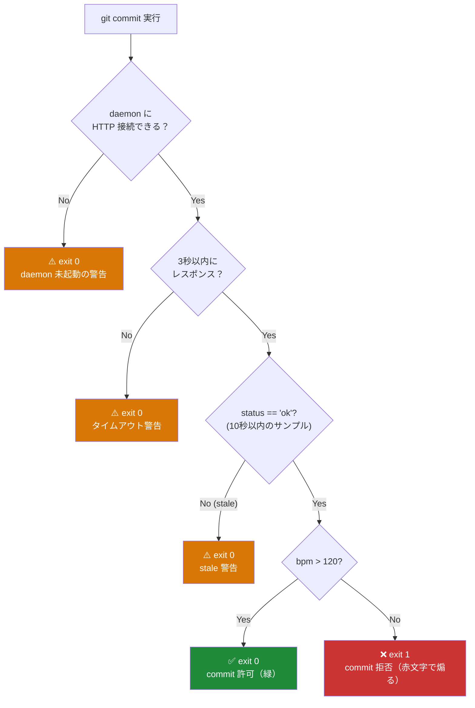
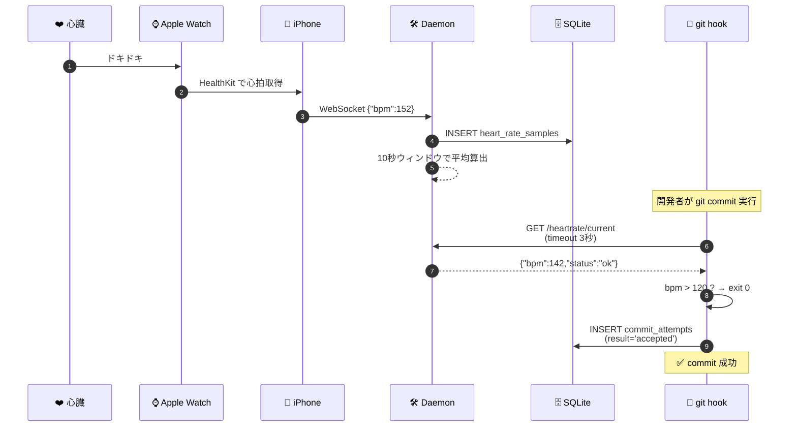
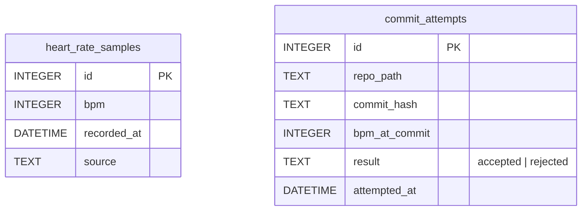

# Doki Doki Development (DDD) — プロジェクト詳細

`git commit` する瞬間の心拍数が **120bpm を超えていないとコミットを拒否する**、
git pre-commit 連動型の開発環境。
Apple Watch が計測した心拍データをローカルデーモンにストリーミングし、
**本気で書かれたコードだけが master を進める**という、極めて物理的な品質ゲートです。

> ※ Domain Driven Design ではありません。**D**oki **D**oki **D**evelopment です。

---

## 機能内容

### ❤️ 心拍ゲート付き git commit

`git commit` を実行すると、pre-commit hook がローカルデーモンに HTTP 問い合わせ。
過去 10 秒の平均 bpm が **閾値（デフォルト 120bpm）を超えていれば許可、超えていなければ赤文字で煽って拒否**します。

### ⌚ Apple Watch → iPhone → Daemon のリアルタイム心拍ストリーム

iPhone の Swift Companion アプリが HealthKit から心拍を取得し、WebSocket で常時デーモンに送信。
ローカルデーモンは 10 秒スライディングウィンドウで平均値を保持します。

### 📈 Web Dashboard で「いつ・どのくらいドキドキしながら書いたか」を可視化

Firebase RTDB に同期された commit 試行履歴と BPM 推移をブラウザで閲覧可能。
**自分の commit が拒否された回数が永久にデータベースに残る**という、地味に精神攻撃が強い機能です。

### 😇 フェイルセーフ寄りの判定ロジック

| 状態 | hook の挙動 |
|------|------------|
| daemon 未起動 | exit 0 + 警告 |
| タイムアウト（3秒超） | exit 0 + 警告 |
| stale（10秒以上サンプルなし） | exit 0 + 警告 |
| bpm ≤ 120 | **exit 1（拒否）** |
| bpm > 120 | exit 0（許可） |

本気で開発を止めにきている訳ではなく、**「Apple Watch 外せば回避できる」性善説**で成り立っています。

### 🔥 ANSI カラーで殴る拒否メッセージ

```
❌ [DDD] 心拍数 87 bpm。落ち着きすぎです。本気を出してください。
✅ [DDD] 心拍数 142 bpm。OK、commit を許可します。
```

### 🛠 1 バイナリで Mac / Windows / Linux に配布可能

CGO ゼロでクロスビルド可能なので、`mise run hooks:install` 一発でどの OS でもセットアップ完了します。

---

## 推しアイデア

> **「コードに本気で向き合っている時、人間の心臓は本当に速く打つのか？」**

この問いに対して **「測ればいいじゃん」** で出した答えが DDD です。

エンジニアは普段、`git commit -m "fix"` を惰性で打ちます。
本当に価値あるコミットは「ドキドキ」しながら書かれているはずなのに、その瞬間の身体状態は**どこにも記録されません**。

DDD は **生体情報を開発フローに直結**させることで、

- コードを書く瞬間の身体状態が **永久に DB に保存される**
- チームメンバーが **そのコードが書かれた瞬間の心拍数を知れる**
- 「この commit、書いた時 175bpm だったらしい」が**普通の会話になる**

という、**コードの裏側にある人間の身体性を可視化する開発体験**を提案します。

ソースコードという「結果」だけでなく、**コードが生まれた瞬間の書き手の身体**をシェアする。
これが DDD が目指す **生体情報レイヤでの非言語コラボレーション** です。

---

## 技術構成図

### アーキテクチャ全体

```mermaid
flowchart TD
    Heart["❤️ あなたの心臓"] -->|血液を全身に送る| Watch
    Watch["⌚ Apple Watch<br/>(心拍センサー)"] -->|HealthKit| Phone
    Phone["📱 iPhone<br/>(Swift Companion App)"] -->|WebSocket<br/>{bpm, timestamp}| Daemon

    subgraph Local["🖥 ローカルマシン (localhost:8765)"]
        Daemon["🛠 Go Daemon<br/>echo + gorilla/ws"]
        HRM["📊 internal/hrm<br/>10秒スライディングウィンドウ"]
        DB[("🗄 SQLite<br/>modernc.org/sqlite")]
        Daemon --> HRM
        Daemon --> DB
    end

    Daemon -->|GET /heartrate/current| Hook
    Hook["🚦 git pre-commit hook<br/>(Go binary)"]
    Hook -->|"bpm > 120"| Allow["✅ exit 0<br/>commit 許可"]
    Hook -->|"bpm ≤ 120"| Deny["❌ exit 1<br/>commit 拒否"]
    Hook -->|"daemon死亡 / timeout / stale"| Warn["⚠️ exit 0<br/>警告のみ"]

    Cloud[("☁️ Firebase RTDB<br/>Dashboard 用クラウド層")]
    Daemon -.->|onValue 同期| Cloud
    Cloud --> Dashboard["📈 Web Dashboard<br/>(React)"]
```

### commit 時の判定フロー



### リアルタイム心拍パイプライン



### SQLite スキーマ



---

## 技術的ポイント

### ① Pure Go SQLite (`modernc.org/sqlite`) でゼロ CGO クロスビルド

`mattn/go-sqlite3` は CGO 必須で、Windows ビルドが地獄になります。
**modernc 版は Pure Go なので `GOOS=windows go build` が一発で通る**。

```bash
GOOS=windows GOARCH=amd64 go build  # 通る
GOOS=darwin  GOARCH=arm64 go build  # 通る
GOOS=linux   GOARCH=amd64 go build  # 通る
```

チームが Mac / Windows / WSL の三国志状態でも環境差で詰まないのは、ほぼこの選定のおかげです。

### ② 10 秒スライディングウィンドウで「持続したドキドキ」を判定

瞬間値だと咳・くしゃみ・スマホを落とした驚きで簡単に超えてしまうため、
`internal/hrm` パッケージで **過去 10 秒の平均 bpm** を `sync.Mutex` 保護で保持しています。

これにより「commit 直前にスクワットして bpm を稼ぐ」攻撃が **10 秒の苦行に格上げ** されました。

### ③ git hook のフェイルセーフ設計

タイムアウト 3 秒、daemon 未起動・stale はすべて `exit 0 + 警告` に倒すことで、
**「daemon が死んでて commit できない」事故ゼロ**を達成。
本当に拒否するのは「bpm が計測できていて、かつ閾値以下」のときだけ。

### ④ HealthKit のサンプリング頻度を上げる小ワザ

省電力モードで動く HealthKit のクエリは `HKObserverQuery` でも更新間隔が数秒〜十数秒空きます。
**`HKAnchoredObjectQuery` + workout session** を組み合わせて、**Apple Watch にずっとワークアウト中だと思わせる**ハックで頻度を確保しました。

### ⑤ Firebase RTDB の `onValue` でクラウド側にもフォールバック

最新コミット (#95) で、ローカルデーモンが落ちている時もクラウド側の BPM・コミット履歴を Dashboard が拾えるように切替。
**ローカルデーモンが死んでも記録は残る**設計です。

### ⑥ 環境変数で閾値を可変に

```bash
DDD_DAEMON_PORT   = 8765
DDD_THRESHOLD_BPM = 120  # 自分の安静時心拍 + α にチューニング可
```

「閾値を下げれば全 commit 通るのでは？」という指摘に対しては **「それは自分との戦いです」** で押し切っています。

---

## 頑張ったこと

### 🎯 「生体情報 × 開発フロー」というやったことのない統合
- 心拍数を「開発ツールの入力ソース」として一級市民扱いした
- BPM が `git commit` の通行ゲートになる、業界初（自称）の体験
- 人体を peripheral として扱う、**IoT という言葉の解像度が爆上がり**するプロジェクト

### 🧱 4 言語 / 7 コンポーネントを 1 つの動線に束ねた
**Swift / Go / TypeScript / shell** の 4 言語を、`git commit` から `dashboard 表示` までの 1 動線で破綻なく統合:

```
Apple Watch (Swift) → iPhone (Swift) → daemon (Go) → SQLite + RTDB
                                        ↓                  ↓
                                   git hook (shell+Go)   dashboard (TS/Next.js)
                                                          + VS Code 拡張 (TS)
```

各境界で **JSON over WebSocket / REST / Firebase Admin SDK** を統一プロトコルとして敷いた結果、どこか 1 つが落ちても他が動く構成に。

### 📦 1 バイナリ配布で 3 OS 完走
- daemon と git hook を **Pure Go (`modernc.org/sqlite`)** で実装、CGO ゼロ
- → macOS 1 台から `GOOS=windows / linux go build` で全 OS 向けバイナリ生成
- チームに Mac / Windows / WSL が混在しても**環境差で 1 回も詰まらなかった**

### 📊 全コミット試行をフル観測
- 拒否された commit も含めて `commit_attempts` テーブル + Firebase RTDB に二重保存
- → 「ジョーク機能」ではなく**情熱の定量データセット**として蓄積
- ダッシュボードに「DEAD ランキング」「最高 BPM コミット」「ヒートマップ」が出るのはこの蓄積のおかげ
- **過去の自分の拒否履歴がクラウドに永久保存**される。逃げ場なし

### ⚡ サブ秒レイテンシで人体に追従
- Apple Watch 既製アプリ + HealthKit クエリ = 数秒〜数十秒の遅延で失敗
- 独自 Watch アプリ + **`HKLiveWorkoutBuilder`** に切り替えてサブ秒応答を実現
- 加えて **3 経路フェイルオーバー** (Watch 直送 / iPhone 中継 / HealthKit フォールバック)

### 🔥 `type` コマンド override で「書けないモード」実装
- VSCodeVim と同じ `vscode.commands.registerCommand("type", ...)` 手法
- BPM 未満ならキー入力を物理的にブロック → 走るしかない開発者の誕生
- 緊急解除キー 5 重で「センサー故障で詰む」事故を防止

### 📜 CLAUDE.md にチーム共通の「踏んではいけない罠」を集約
```md
# よくある間違い
× パスに ~ を使う（Windows で動かない）
× CGO が必要なライブラリ（クロスビルド不可）
× エラーの握りつぶし
× log.Fatal を main 以外で使う
```
最初にこれを書いたことで、レビューが **「CLAUDE.md 100 行目見て」だけで終わる**ようになりました。
**ドキュメント駆動レビュー**という名のサボり開発です。

### 🧰 mise でタスクを統一
`mise run daemon:run` / `daemon:test` / `hooks:install` で 3 OS 共通のフローを実現。
「俺の環境では動くんだが？」を撲滅しました。

---

## 難しかったこと

### 🎭 拒否される側もエンタメに変える UX 設計
- 「コミット拒否」は本質的に**ユーザーの作業を止める**ストレス体験
- 単に exit 1 だと開発者がブチギレるので、**煽る方向**に振り切った:
  - ターミナルで赤い ANSI + 「情熱が足りません」+ 心拍上げ方サジェスト
  - VS Code 側で**グリッチ + 画面ヒビ + ダメージコメント挿入**の 3 段階演出
  - 成功時は Tier 1〜5 で段階的に派手さが上がる ("LEGENDARY" / "心臓破り")
- 結果: **「拒否されたら笑える」**という不思議な開発体験に
- git は本来寡黙なツールですが、このプロダクトは **git をやかましく**します

### 🪤 WebSocket の「切れた時」の処理
- 「繋ぐ」は 5 行で書けるが「切れた時」がプロダクト品質の差
- 対応した境界:
  - iPhone のスリープで `WCSession` 切断
  - Wi-Fi 切替で WebSocket 失効
  - daemon 再起動で全クライアント切断
  - Vercel デプロイから `ws://localhost` への到達不可
- **指数バックオフ自動再接続** + **3 秒で RTDB onValue へフォールバック**で全部救った
- 学び: **WebSocket は「繋ぐ」より「切れた時の処理」のほうが 3 倍重い**

### ⌚ HealthKit が 1Hz をくれない問題
- 通常の `HKAnchoredObjectQuery` は数十秒に 1 回しか心拍をくれない
- ハッカソンに必要な「コミット直前のリアルタイム BPM」が成立しない
- 解決: **`HKWorkoutSession` を起動して Apple Watch に「ずっと運動中」と思わせる**
- → `HKLiveWorkoutBuilder` 経由で**1Hz 連続サンプル**を取得
- **Apple Watch の省電力設計と全力で戦う**形になり、Workout 自動停止タイマーは別途必要

### 🎨 ヒートマップの色域設計
- 「赤 = 燃えてる」「青 = 冷めてる」の直感が強い
- が、**赤緑色覚多様性ユーザー**には判別困難な配色になりがち
- 候補: D3 colorbrewer, viridis, magma, plasma を全部試作
- 最終的に **viridis 系グラデーション**（青〜緑〜黄）に落ち着いた
- 「赤い情熱」のメタファーは失うが、**全員が読めることを優先**

### 🛡 fail-safe な Firebase 初期化
- credentials が無い参加者でも daemon がクラッシュしないように
- `OpenRTDB` が `(nil, nil)` を返す + 全メソッドが nil レシーバ no-op
- → 「Firebase 設定面倒くさい」勢が即ローカル試遊できる導線を確保

### 🎬 演出の 3 段構え化
- 当初の commit 演出は 1 フェーズで「パッと出てパッと消える」 → インパクト不足
- **予告 (鼓動 + 白フラッシュ) → 主演出 → 余韻** の 3 フェーズに再設計
- BPM Tier に応じて Tier 4+ では**サイドバー閉じ + 2 パネル並列表示**で全画面占有

### 🗄 Firebase RTDB のスキーマ設計
- リアルタイムに変化する BPM 値と、追記型の commit 履歴をどう同居させるか
- `onValue` のサブスクリプション粒度を間違えると **無限再レンダリング地獄**に落ちる
- 何度か落ちた

---

## 苦労したこと

### 🪟 Windows / WSL のパス地獄
- `~/.ddd/ddd.db` と書いた瞬間に Windows daemon が死ぬ
- → CLAUDE.md に **「`os.UserHomeDir()` 必須」**を太字で叩き込み
- WSL では `C:\...` と `/mnt/c/...` の混在で Docker volume mount が壊れる
- **arm では動くのに x86 だと動かねぇ**問題
- レビュー時のチェック項目に「パスに `~` 使ってないか」を常設
- WSL は便利ですが、許してはくれません

### 💔 閾値 120bpm 問題（健康な 20 代問題）
- 設計時の想定: 「コミット = 緊張」で自然と 120bpm 超える
- 現実: 健康な 20 代男性は**歩くだけで 120bpm 超える**
- デモ初日に「全 commit 通る」状態が発覚し、設計思想が崩壊
- 緊急対応:
  - 閾値を環境変数 `DDD_THRESHOLD_BPM` で**人別調整可**に
  - デモ用 `--demo` フラグで一時的に閾値 150 に
  - 「閾値はあなたのベースライン + 30bpm」というガイドラインを README に追加

### 🤬 `context canceled` 沼
- POST /commits → 201 返るのに Firebase に書かれない
- 原因は**親 context に `c.Request().Context()` を使っていた**こと
- HTTP レスポンス返却の瞬間に goroutine の context もキャンセル → 書き込み失敗
- ログには `rtdb: add commit: context canceled` しか出ず特定に数時間
- 教訓: **goroutine 内の context は `context.Background()` を起点に**

### 🚫 Vercel から `ws://localhost` 大量エラー
- Vercel デプロイ後、ブラウザ Console が真っ赤に
- `Mixed Content: ws://localhost from https://*.vercel.app` の連発
- 対応: `window.location.hostname` で**クラウド環境なら WS スキップ → 即 RTDB フォールバック**
- 副作用: ローカル開発時の WS-first 経路は維持する分岐実装が増えた

### 🔐 serviceAccount.json をうっかり開発ブランチに置いた
- Firebase 秘密鍵 JSON を repo 直下に置いた瞬間に冷や汗
- 慌てて `.gitignore` の `**/firebase-credentials*.json` を `serviceAccount.json` も対象に拡張
- 幸い `git ls-files` で未追跡確認できて事なきを得る
- ハッカソン中盤の最大ヒヤリ案件

### 🥊 VSCodeVim との衝突
- `type` コマンド override は Vim 系拡張と取り合いになる
- 同時アクティブで先勝ち負けが発生 → どちらかが動かなくなる
- → 起動時に `vscode.extensions.getExtension("vscodevim.vim")` を検出して自動 disable
- 設定 `skipIfVimDetected` で「分かってる人は強制有効化」も可能に

### 🌊 ダブルスラッシュ事件
- `dashboard/.env.local` の `NEXT_PUBLIC_DAEMON_URL=http://localhost:8765/` (末尾 `/`)
- → `${BASE}/commits` が `http://localhost:8765//commits` に
- → 404 連発、しかも CORS エラーと重なって原因特定に時間を浪費
- → コード側で `.replace(/\/+$/, "")` で末尾スラッシュを強制削除する防御を追加

### 🌙 真夜中問題
- 夜中の commit は心拍が落ちます
- **生体的に commit が許可されない時間帯がある**ことが判明
- 「23 時以降は閾値を下げる」案が浮上しましたが、最終的に **「眠いなら commit するな」** という健全な結論に着地
- このプロダクト、**意外と健康に貢献している**説があります

### 🤖 AI レビューが優秀すぎ問題
- Devin と Claude Code の自動レビューが優秀すぎて、**人間がレビューする前に全部指摘される**
- PR を出すと、5 秒後に AI から的確な改善要望が飛んできます
- **人間とは何か**を考えさせられる開発体験でした

### 🧠 デモ用に閾値を毎回調整する仕様
- ハッカソン本番で「**心拍 80bpm でも commit できるデモ**」をやってしまうと興ざめなので、本番直前に走り込みしてから登壇する、という運用が確立されました
- **プロダクト発表 = 体力勝負**

---

## まとめ

- ❤️ **心拍 × git hook** という極めて物理的な開発体験
- 🛠 **Pure Go SQLite** で OS 差を全部潰したクロスビルド
- 📊 commit のたびに **自分の心拍が DB に永久保存**される地獄
- ☁️ Firebase RTDB でクラウド冗長化、**死後の心電図**閲覧可能
- 😇 ハッカソンジョークプロダクトですが、**意外と本気の commit が増えました**

**Doki Doki Development**、ぜひ一度、心臓と git を直結させてみてください。
