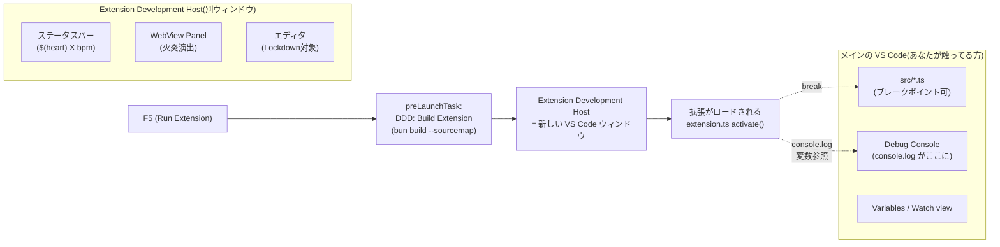
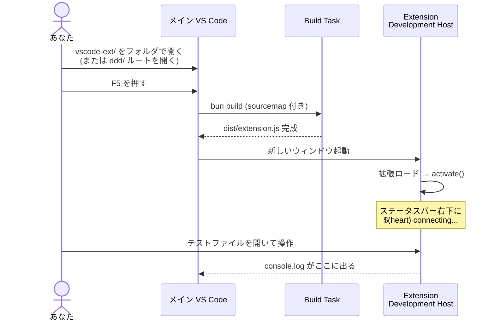
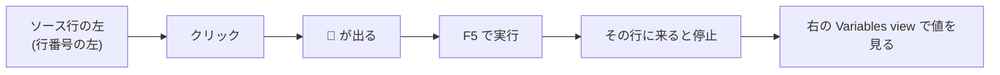
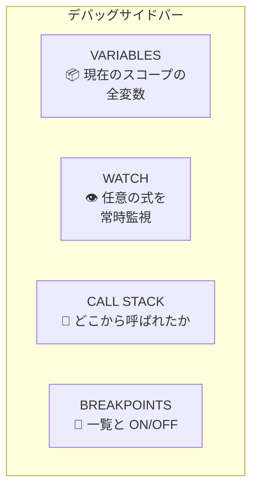
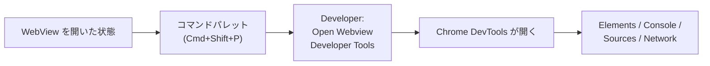
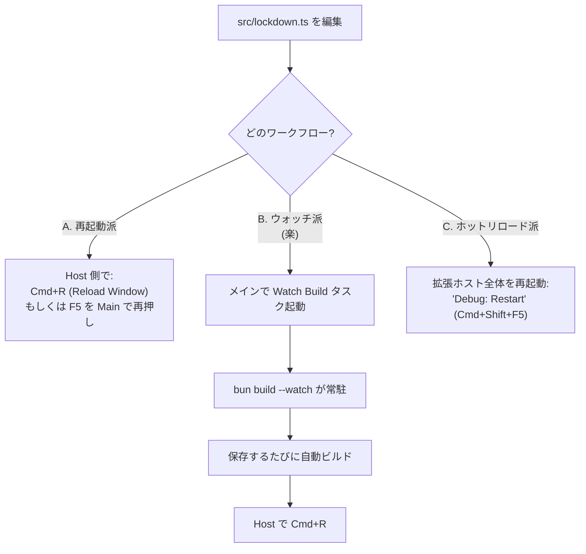
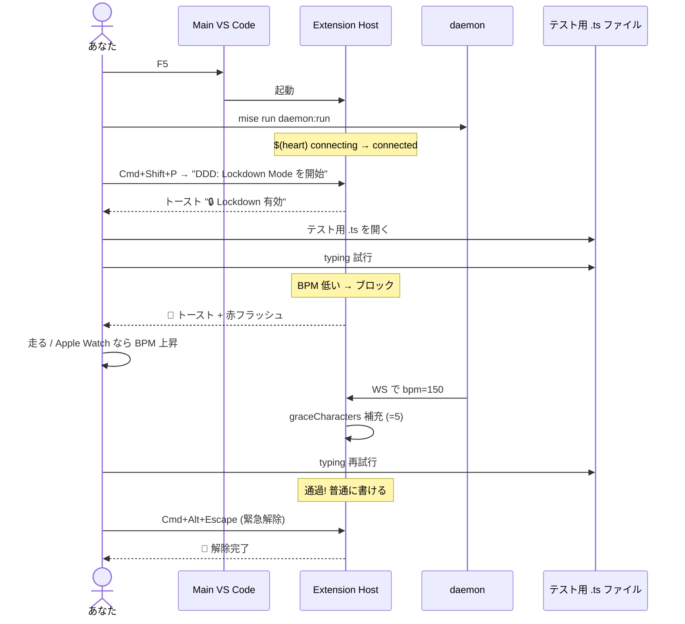

# VS Code 拡張デバッグガイド

**対象**: `vscode-ext/` 内の DDD 拡張（commit 演出 + Lockdown Mode）
**前提**: launch.json / tasks.json は本ガイドと同時にリポジトリルートの `.vscode/` に整備済み

---

## 0. デバッグの全体像



**鍵となる概念**:
- **2 つの VS Code が立つ**: あなたが今触ってるメインウィンドウ（ソースコードを編集する側）と、Extension Development Host（拡張が動いている、テスト対象側）
- メイン側で **ブレークポイント** を置くと、Host 側で実行が止まる
- `console.log` は **メイン側の Debug Console** に出る

---

## 1. クイックスタート

### 一番手っ取り早い方法



**手順** (3 ステップ):
1. メイン VS Code で **ワークスペースルート（`ddd/`）を開く**
2. **F5** を押す（または Run and Debug ビューから `Run DDD Extension` 選択）
3. 新ウィンドウが立つ → ステータスバー右下に `$(heart) connecting...` が出れば OK

> ⚠️ `vscode-ext/` だけを開いても OK。ワークスペースのトップが `.vscode/launch.json` を含んでいれば動く。

---

## 2. launch.json の 3 つの起動構成

リポジトリルートの `.vscode/launch.json` に 3 構成を用意済み。状況に応じて使い分ける。

| 構成 | 用途 | 特徴 |
|---|---|---|
| **Run VS Code Extension** | 通常のデバッグ | 自動ビルド → 拡張ホスト起動。既存のプロファイル（他拡張・設定全部）が乗る |
| **Run VS Code Extension (clean profile)** | 切り分け | `--disable-extensions --profile-temp` で**他拡張全 OFF・新規プロファイル**。Vim 拡張等と衝突疑いの時に |
| **Attach to Extension Host** | 既存プロセスに後付け | 起動済みの拡張ホストに後からアタッチ（port 9229） |

Run and Debug ビュー（左の虫マークアイコン）の上部ドロップダウンで切替。

---

## 3. ブレークポイント

### 置き方



実例: `src/lockdown.ts` の `handleType` 関数の行頭でブレーク
```typescript
private async handleType(args: TypeCommandArgs): Promise<unknown> {
  if (this.canTypeNow()) {           // ← ここに 🔴
    return vscode.commands.executeCommand("default:type", args);
  }
  this.triggerFeedback();
  ...
}
```

→ Host 側でキー入力するたびに止まる。

### 条件付きブレークポイント

🔴 を右クリック → **Edit Breakpoint**
- **Expression**: `args.text === 'a'` のように条件式 → 真のときだけ止まる
- **Hit Count**: `> 5` のように回数指定 → 6 回目で止まる
- **Log message**: `bpm={this.currentBpm}, canType={this.canTypeNow()}` → 止まらず Debug Console に出力（`console.log` を埋める代わりに使える）

### よく使う場所

| ファイル:行 | 目的 |
|---|---|
| `extension.ts` の `handleBpmUpdate` | WS で BPM を受信した瞬間を見たい |
| `extension.ts` の `handleCommitResult` | commit_result が来た瞬間 |
| `lockdown.ts` の `handleType` | キー入力 1 回ごとの判定 |
| `lockdown.ts` の `canTypeNow` | ロック判定ロジックの分岐 |
| `lockdown.ts` の `triggerFeedback` | 拒絶演出が走った直後 |

---

## 4. 変数の中身を見る

止まった状態で **右側のサイドバー** に複数のビューが出る。



### VARIABLES ビュー
- ローカル変数、引数、`this`（クラスのインスタンス）が全部見える
- 三角を開けばネストしたオブジェクトもツリーで見える
- 右クリックで `Copy Value` で値をクリップボードに

### WATCH ビュー（おすすめ）
左上の **+** ボタンで式を追加:
- `this.currentBpm`
- `this.cfg.threshold`
- `this.graceRemaining`
- `lockdownController?.isActive()`（extension.ts スコープで）

→ ブレークするたびに最新値が表示される。

### Debug Console から評価
画面下部の **DEBUG CONSOLE** に直接式を打てる:
```console
> this.currentBpm
142
> this.cfg
{ enabled: true, threshold: 120, ... }
> vscode.window.activeTextEditor?.document.uri.fsPath
'/path/to/file.ts'
```

→ **任意の JS を実行できる**ので、状態を変えてしまうこともできる:
```console
> this.graceRemaining = 100
100
```

---

## 5. `console.log` の使い方

```typescript
// src/lockdown.ts に仕込む
console.log("DDD lockdown handleType called:", args, "bpm=", this.currentBpm);
```

→ メイン VS Code の **Debug Console** に出力される。

### ログレベル
| メソッド | 用途 | 見え方 |
|---|---|---|
| `console.log` | 通常 | 普通 |
| `console.warn` | 警告 | ⚠️ 黄色 |
| `console.error` | エラー | ❌ 赤 |
| `console.table([...])` | 配列・オブジェクト一覧 | 表形式 |
| `console.dir(obj, {depth: 5})` | 深くネスト | 全層展開 |

### Debug Console を消す

メインの Debug Console のゴミ箱アイコン、または右クリック → `Clear Console`。

---

## 6. WebView の中身をデバッグ

WebView (火炎パネル等) の中の HTML/CSS/JS は**別プロセス**なので、上記の方法では止められない。WebView 内には専用 DevTools がある。



### 手順
1. Host 側で WebView パネルを開く（例: コミット演出を発火させる）
2. **コマンドパレット** で `Developer: Open Webview Developer Tools` を実行
3. Chrome の DevTools が開く

### DevTools でできること
- **Elements**: WebView の DOM ツリー、CSS、computed style を見られる
- **Console**: WebView 内 JS の `console.log` がここに、任意の JS も実行可
- **Sources**: WebView 内の JS ファイルを見てブレークポイント可（ただしソースマップは別途）
- **Network**: `` や `<audio>` のリクエストを追える

### よくある WebView デバッグ
| 症状 | 確認 |
|---|---|
| アニメが動かない | Elements で `<style>` 内の `@keyframes` を確認、computed style で `animation` プロパティ |
| 文字化け | Elements で `<meta charset="UTF-8">` の有無 |
| `<audio>` が鳴らない | Console で「Autoplay was prevented」を探す（→ ユーザー操作後に再生する必要） |
| 効果音が鳴らない | Console で `new Audio('...').play()` を手動実行してエラー確認 |

---

## 7. ホットリロード（コード変更を反映する）

拡張のコードを変えてからすぐ動作確認したい時:



### おすすめワークフロー: B（ウォッチビルド + Reload Window）

1. メイン VS Code でコマンドパレット → `Tasks: Run Task` → `DDD: Watch Build` を起動
   → 別ターミナルが開いて `bun build --watch` が常駐
2. F5 で拡張ホスト起動
3. コード変更 → 保存 → 自動でビルドが走る
4. Host 側で **Cmd+R**（Reload Window）→ 拡張が新コードでロードし直される

> 💡 `Cmd+R` の代わりに、メインで **`Debug: Restart`**（Cmd+Shift+F5）でも OK。
> ただしこれだと preLaunchTask（フルビルド）が再実行されるので、ウォッチ走らせてるなら Cmd+R の方が早い。

---

## 8. WebSocket の通信を覗く

daemon との WS 通信を観察したい時:

### A. websocat で別途接続

```bash
brew install websocat
# 拡張と同じエンドポイントに接続
websocat ws://localhost:8765/ws/vscode
# → bpm メッセージが 1 秒ごとに流れてくる
```

### B. 拡張側に console.log を仕込む

`extension.ts` の `ws.addEventListener("message", ...)` の中に:
```typescript
ws.addEventListener("message", (event) => {
  console.log("DDD WS recv:", event.data);  // ← デバッグ追加
  try { ... }
});
```

### C. ステータスバー Tooltip
ステータスバーにマウスを乗せれば `DDD: 142 bpm (閾値: 120)` のようなツールチップが出る。WS 受信が来てるかの簡易確認に。

---

## 9. Lockdown の動作確認手順



### Apple Watch がない時のテスト方法

websocat で手動 BPM 注入:
```bash
websocat ws://localhost:8765/ws
# 接続後、JSON を貼る
{"bpm":150,"timestamp":"2026-05-24T00:00:00Z"}
```

または curl で commit_result を直接送る:
```bash
curl -X POST http://localhost:8765/commits \
  -H "Content-Type: application/json" \
  -d '{"repo_path":"/tmp","commit_hash":"","bpm":95,"result":"rejected"}'
```

---

## 10. よくある詰まり

| 症状 | 原因 | 対応 |
|---|---|---|
| F5 で何も起こらない | launch.json が見つからない | ワークスペースルートが `ddd/` か `vscode-ext/` か確認。`Cmd+Shift+P` → `Debug: Open launch.json` |
| ブレークポイントが当たらない（灰色のまま） | sourcemap が出てない | `dist/extension.js.map` が存在するか確認。`bun run compile` を手動実行 |
| ブレークポイントは当たるが「行が一致しない」 | コンパイル後と古い source map がズレ | Host を Cmd+R で reload、それでもダメなら Main を F5 で再起動 |
| `vscode.workspace.getConfiguration(...)` が undefined を返す | 設定スキーマ未反映 | package.json の `contributes.configuration` を保存後、Host を再起動 |
| `Could not resolve "vscode"` | compile スクリプトに `--external vscode` がない | 既に修正済み（PR `feature/vscode-ext-presentation` で） |
| Lockdown が効かない | `enabled` が false / `start` してない | コマンドパレット `DDD: Lockdown Mode を開始` |
| キー押しても何も起きない（壊れた？） | Lockdown が掛かったままで緊急解除されてない | **Cmd+Alt+Escape** |
| Vim 拡張と競合 | `type` コマンドが両方で取り合い | `skipIfVimDetected: true` を確認、または Vim を一時 disable |
| WebView が空白 | スクリプトエラー | WebView DevTools で Console 確認 |
| `console.log` が見えない | Debug Console を開いていない | `View > Debug Console` (Cmd+Shift+Y) |
| 効果音が鳴らない | macOS のサウンド設定 / 同名 .aiff が無い | `afplay /System/Library/Sounds/Hero.aiff` を手動実行 |

---

## 11. 便利なショートカット

| ショートカット (Mac) | 用途 |
|---|---|
| **F5** | デバッグ起動 / 続行 |
| **F9** | カーソル行にブレークポイント |
| **F10** | ステップオーバー |
| **F11** | ステップイン |
| **Shift+F11** | ステップアウト |
| **Shift+F5** | デバッグ停止 |
| **Cmd+Shift+F5** | デバッグ再起動 |
| **Cmd+R** (Host 側) | ウィンドウ Reload |
| **Cmd+Shift+P** | コマンドパレット |
| **Cmd+Shift+Y** | Debug Console |
| **Cmd+Shift+D** | Run and Debug ビュー |
| **Cmd+\\** | サイドバー開閉 |
| **Cmd+Alt+Escape** (Host 側) | Lockdown 強制解除 |

---

## 12. デバッグログをファイルに残す

長時間の動作を後から振り返りたい時:

```typescript
// extension.ts や lockdown.ts の冒頭付近に追加
const dddLog = vscode.window.createOutputChannel("DDD");

// 任意の場所で
dddLog.appendLine(`[${new Date().toISOString()}] bpm=${bpm} locked=${this.active}`);
```

→ Host 側の **OUTPUT パネル**（View > Output）のドロップダウンで `DDD` を選ぶと、累積ログが見える。
   `dddLog.show()` で自動表示も可能。

---

## 13. パッケージ化前の確認

開発が一段落して `.vsix` を作りたくなったら:

```bash
cd vscode-ext
bun run compile          # 本番ビルド
bun run package          # vsce package → ddd-vscode-0.0.1.vsix が出る
code --install-extension ddd-vscode-0.0.1.vsix   # ローカルにインストール
```

→ Extension Development Host ではなく**普通の VS Code**でもインストールして動作確認できる。

---

## 14. 仕組みを深掘りしたくなったら

| トピック | リンク |
|---|---|
| Extension API 全体 | https://code.visualstudio.com/api |
| デバッグ詳細 | https://code.visualstudio.com/api/working-with-extensions/debugging-an-extension |
| WebView API | https://code.visualstudio.com/api/extension-guides/webview |
| `type` コマンド上書き | VSCodeVim のソース: https://github.com/VSCodeVim/Vim/blob/master/src/extensionBase.ts |
| 本プロジェクトの計画書 | `docs/plans/vscode-ext-presentation-upgrade.md` / `docs/plans/vscode-ext-lockdown-mode.md` |

---

## 15. 「とりあえずまず動かす」最短経路

迷ったらこれだけ:

```bash
# 1. ルートを VS Code で開く
code /Users/kotaro/ddd

# 2. 別ターミナルで daemon
mise run daemon:run

# 3. メイン VS Code で
# F5
```

→ 新ウィンドウが立つ → 何かファイルを開く → コマンドパレットで `DDD: Lockdown Mode を開始` → typing してブロックされるか試す。

困ったら **Cmd+Alt+Escape** で緊急解除、それでもダメなら Host ウィンドウを閉じれば OK。
